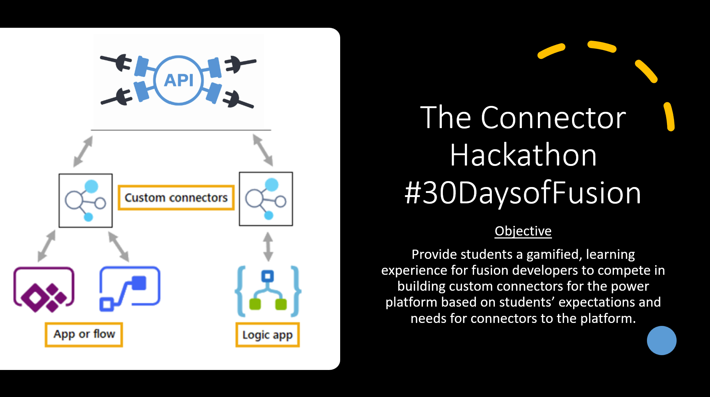

<head>
  <meta name="twitter:url" content="https://microsoft.github.io/30DaysOf/blog/welcome-to-30DaysofFusion" />
  <meta name="twitter:title" content="30DaysOfFusion Kick-Off" />
  <meta name="twitter:description" content="Join us for #30DaysOfLearning initiatives that take you from fundamental concepts to functional code to cloud deployment!" />
  <meta name="twitter:image" content="https://microsoft.github.io/30DaysOf/img/logo.svg" />
  <meta name="twitter:card" content="summary_large_image" />
  <meta name="twitter:creator" content="@nitya" />
  <meta name="twitter:site" content="@AzureAdvocates" /> 
  <link rel="canonical" href="soft.com/t5/educator-developer-blog/onboarding-guide-for-30days-of-learning-participants/ba-p/3485136" />
</head>

## Welcome! 

[The Connector Hackathon Welcome Message](https://aka.ms/TheConnectorHackathon)

## Where to find us

 * [Blog](/blog) - subscribe to the [feed](/blog/rss.xml) for announcements & updates
 * [Roadmap](/docs/roadmaps/fusion) - Our 30 Day schedule
 * [A Challenge for you](https://aka.ms/ConnectorSkillsChallenge) - Join our Clouds Skills Challenges and compete with your peers for an award
 * [Discussion](https://github.com/microsoft/30daysof/discussions/16) - ask questions, interact with peers, show-and-tell!

## Your First Actions
1. Gear up: 