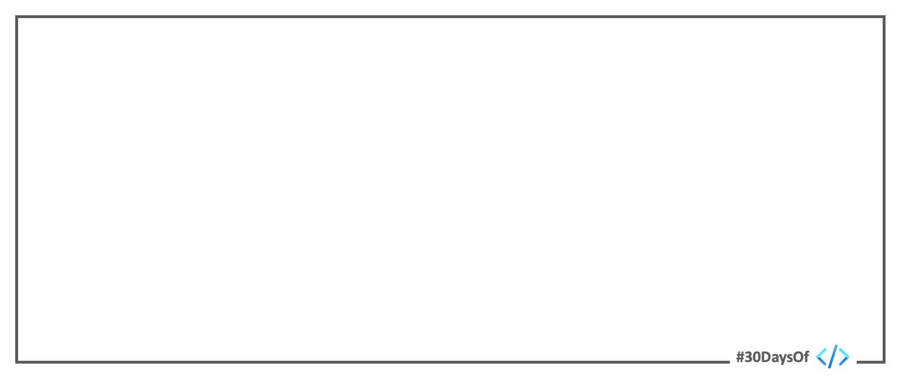

<head>
  <meta name="twitter:url" content="https://microsoft.github.io/30daysof/blog/learning-hub" />
  <meta name="twitter:title" content="Hello, 30Days Of Learning!" />
  <meta name="twitter:description" content="Welcome to the #30DaysOfLearning hub! Your one-stop destination for resources, events and community to help you skill up!" />
  <meta name="twitter:image" content="https://microsoft.github.io/30daysof/assets/images/empty-21460021e4358d11e7c45383dc187d62.png" />
  <meta name="twitter:card" content="summary_large_image" />
  <meta name="twitter:creator" content="@nitya" />
  <meta name="twitter:site" content="@AzureAdvocates" /> 
</head>

## What We'll Cover
 * What is Serverless September? (6 initiatives)
 * How can I _participate_? (3 actions)
 * How can I _skill up_ (30 days)
 * Who is behind this? (Team Contributors)
 * How can _you_ contribute? (Custom Issues)
 * **Exercise**: Take the [Cloud Skills Challenge](https://docs.microsoft.com/en-us/learn/challenges?id=b950cd7a-d456-46ab-81ba-3bd1ad86dc1c&WT.mc_id=javascript-74010-ninarasi)!
 * **Resources**: [#30DaysOfServerless Collection](https://aka.ms/30DaysOfServerless/collection).

---

## Welcome! 

Hello and welcome to the launch of the #30DaysOf learning hub. 👋🏽

This is a collaborative effort within Developer Relations to collect and share various resources that support self-study and structured learning for beginners and experienced devs alike. Technology changes fast! The only way to adapt, and thrive, is to learn continuously - and apply learnings to practical problems.

So, what does that learning journey look like? Think of it as four stages:
 * **Welcome** - the onboarding phase where you get setup for the journey. 
 * **Guide** - the resource exploration phase, where you pick the path to travel.
 * **Connect** - the community phase where you interact with others on the same journey.
 * **Share** - the pay-it-forward phase where you share your learnings to help the next traveller.

## About The Site

Let's take a quick tour of this site and the various features it offers:

 * [Landing Page](/) - explore the learning options available.
 * [Blog](/blog) - subscribe to the [feed](/blog/rss.xml) for announcements & updates
 * [Calendar](/calendar) - discover upcoming events, revisit archived ones
 * [Roadmaps](/docs/category/roadmaps) - discover and complete #30Day journeys
 * [Curricula](/docs/category/curricula) - explore open-source multi-week courses with lesson plans
 * [Challenges](/docs/category/challenges) - join challenges and compete with your peers
 * [Discussions](https://github.com/microsoft/30daysof/discussions) - ask questions, interact with peers, show-and-tell!

## Your First Actions

Where should you start? 

1. [Take a minute to introduce yourself](https://github.com/microsoft/30daysof/discussions/3) - What are you looking to learn? What are *you* an expert in? Which region are you joining us from?
2. [Check the calendar](/calendar) - look for upcoming or in-progress learning journeys (e.g., #30Days) and join in! Work at your own pace, or look for events and discussions where you can interact with other learners.
3. [Cultivate learning habits](https://www.nytimes.com/2017/08/04/education/edlife/learning-how-to-learn-barbara-oakley.html) - Use techniques that help you learn to learn better. Take breaks, switch between focused and relaxed modes, practice what you learn, and understand that each person learns differently.

Most importantly, **set a goal and keep going towards it one learning step at a time** - connect with others to get help or feel inspired. Then pay it forward by sharing blog posts and showcasing your apps, so others can learn from _you_.

We can't wait to see what you learn - next!
