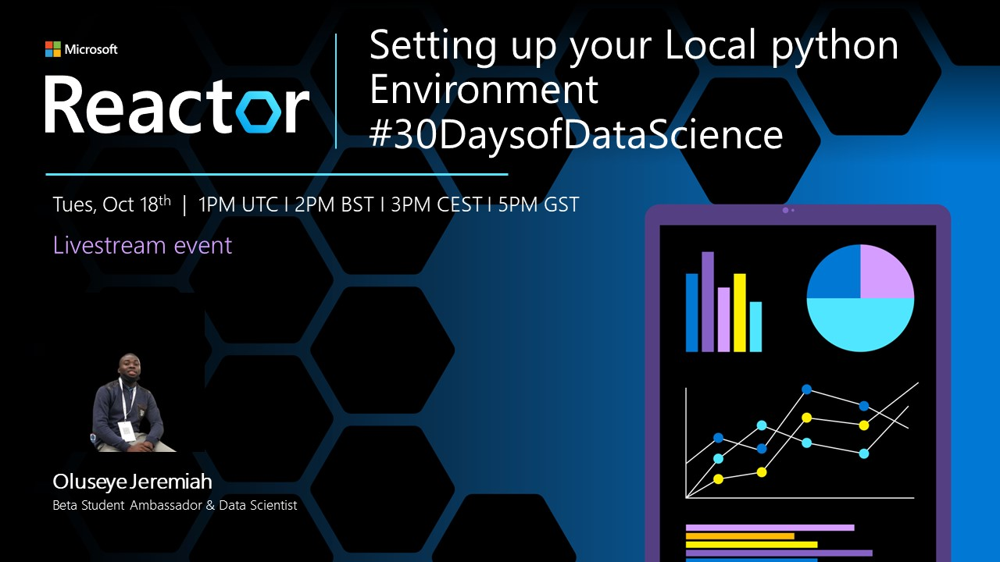

<head>
  <meta name="twitter:url" content="https://microsoft.github.io/30daysof/docs/roadmaps/data-science" />
  <meta name="twitter:title" content="30DaysOfDataScience Kick-Off" />
  <meta name="twitter:description" content="Our goal is to guide you through understanding data and using the knowledge to make decisions such as fraud detection, customer segmentation and product pricing." />
  <meta name="twitter:image" content="https://github.com/microsoft/30daysof/blob/main/website/static/img/banners/data-science.png?raw=true" />
  <meta name="twitter:card" content="summary_large_image" />
  <meta name="twitter:creator" content="@bethanyjep" />
  <meta name="twitter:site" content="@AzureAdvocates" /> 
  <link rel="canonical" href="https://aka.ms/http://aka.ms/30DaysDataScience" />
</head>

## Welcome! 

[30 Days of Data Science Welcome Message](https://aka.ms/http://aka.ms/30DaysDataScience)

Our goal is to guide you through understanding data and using the knowledge to make decisions such as fraud detection, customer segmentation and product pricing. At the end of this, you will have 3 guided projects and one capstone project to showcase in your porfolio.
<iframe width="560" height="315" src="https://www.youtube.com/embed/Vykf7q-IJ2E" title="Welcome to the 30 Days of Data Science" frameborder="0" allow="accelerometer; autoplay; clipboard-write; encrypted-media; gyroscope; picture-in-picture" allowfullscreen></iframe>

---

## Where to find us

 * [Blog](/blog) - subscribe to the [feed](/blog/rss.xml) for announcements & updates
 * [Roadmap](/docs/roadmaps/data-science) - Our 30 Day schedule
 * [Discussion](https://aka.ms/30DS-Discuss) - ask questions, interact with peers, show-and-tell!

 ---

## Your First Actions
 <iframe width="560" height="315" src="https://www.youtube.com/embed/CeYWvmaJwdI" title="All about GitHub Discussions" frameborder="0" allow="accelerometer; autoplay; clipboard-write; encrypted-media; gyroscope; picture-in-picture" allowfullscreen></iframe>
 

1. **Introduce yourself and meet fellow learners:** Learning alone can be daunting. Using GitHub discussions, we have made it easy for you to interact and learn with fellow particants. [Drop in and say Hi!](https://aka.ms/30DS-Discuss)  
1. **Gear up:** You need to set up your Local Environment ready to get started. Learn how to do this for free [here](https://youtu.be/6pMvovj7KbE)
1. **Join the Challenge Today:** Don't be left behind in the learning, this [Cloud Skills Challenge](https://aka.ms/30DS-challenge) contains modules that will give you skills to successfully get started with Python and Azure.

---

## Week One: Getting Started with Python
Python is one of the main programming languages used in Data Science. Our main focus this week is getting started with the python language and building a small python program.

### Self-paced Learning
:::info WEEK 1 self-paced learning
* October 17: [Setting up your local environment](https://youtu.be/6pMvovj7KbE)
* October 18: [Python basics: operators | data types](https://aka.ms/py4beginners)
* October 19: [Python basics: loops | dictionaries](https://aka.ms/py4beginners)
* October 20: [Python basics: functions](https://aka.ms/py4beginners)
* October 21: [Create your first Python program](https://aka.ms/pyBMI)
* October 22: [Move your project from Visual Studio to Github](https://youtu.be/Zxs1eK2acLk)
* October 23: Catch up and reflect with the week's learning.
:::

### Register for the events: Live Sessions

| Date | Time | Session Title | RSVP | Live Link |
|:---|:---|:---|:---| :---| 
|18 October | 1pm GMT | Setting up your Local Python Environment | [RSVP](https://developer.microsoft.com/en-us/reactor/events/17357/?WT.mc_id=academic-78742-bethanycheum) | [LIVE](https://aka.ms/30DaysofDataScienceLIVE) |
| 20 October | 1pm GMT | Create your first program with Python | [RSVP](https://developer.microsoft.com/en-us/reactor/events/17358/?WT.mc_id=academic-78742-bethanycheum) | [LIVE](https://aka.ms/30DaysofDataScienceLIVE) |

---

## Let's get started!
Show up everyday, cover the [daily self paced content](/docs/roadmaps/data-science), [discuss](https://aka.ms/30DS-Discuss) with fellow learners and most of all **share your learnings using #30DaysOfDataScience.**

In two weeks, we will be building projects and this week we are building our foundations. The content we have curate is beginner friendly and we will be here to guide you!

:::success READY? LET'S GO! 🎉
Day 2 >> [Self paced learning](/docs/roadmaps/data-science), [Live session](https://aka.ms/30DaysofDataScienceLIVE) & [discussions](https://aka.ms/30DS-Discuss)!
:::