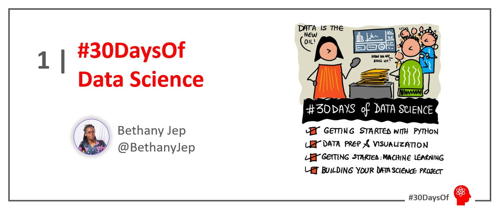

<head>
  <meta name="twitter:url" content="https://microsoft.github.io/30daysof/docs/roadmaps/data-science" />
    <meta name="twitter:title" content="30DaysOfDataScience- How to Build a rock-paper-scissors game." />
  <meta name="twitter:description" content="Our goal is to guide you through understanding data and using the knowledge to make decisions such as fraud detection, customer segmentation and product pricing." />
  <meta name="twitter:image" content="/img/twitter.png" />
  <meta name="twitter:card" content="summary_large_image" />
  <meta name="twitter:creator" content="@bethanyjep" />
  <meta name="twitter:site" content="@AzureAdvocates" /> 
  <link rel="canonical" href="https://aka.ms/http://aka.ms/30DaysDataScience" />
</head>

## Where to find us

 * [Blog](/blog) - subscribe to the [feed](/blog/rss.xml) for announcements & updates
 * [Roadmap](/docs/roadmaps/data-science) - Our 30 Day schedule
 * [Discussions](https://aka.ms/30DS-Discuss) - ask questions, interact with peers, show-and-tell!

---

 ## Setting up and Python Basics

 Welcome to week 1 summary for the #30daysOfDataScience. The week that was we covered Getting Started with Python with self-paced learning on Python Basics. As with every journey, the first step is ensuring you are well equipped. In the first live session, we covered how you can set up your local environment by installing [Python](https://www.python.org/downloads/) and [Visual Studio Code](https://code.visualstudio.com/download):

<iframe width="560" height="315" src="https://www.youtube.com/embed/JKB1EvM5ilY" title="All about GitHub Discussions" frameborder="0" allow="accelerometer; autoplay; clipboard-write; encrypted-media; gyroscope; picture-in-picture" allowfullscreen></iframe>

### Python Basics
:::info WEEK 1 SUMMARY:  PYTHON BASICS
* October 17: [Setting up your local environment](https://youtu.be/6pMvovj7KbE)
* October 18: [Python basics: operators | data types](https://aka.ms/py4beginners)
* October 19: [Python basics: loops | dictionaries](https://aka.ms/py4beginners)
* October 20: [Python basics: functions](https://aka.ms/py4beginners)
* October 21: [Build a Rock Paper Scissors Game](https://aka.ms/30DS-session2)
* October 22: [Move your project from Visual Studio to Github](https://youtu.be/Zxs1eK2acLk)
* October 23: Catch up and reflect with the week's learning.
:::

 ## Build a rock-paper-scissors game

 To sum up what we learnt on Python Basics, we built a GAME!!! While building the game, the basic python concepts: loops, functions, data types and more were covered. Watch the on demand video and follow step by step on how you can build your first python program:

<iframe width="560" height="315" src="https://www.youtube.com/embed/sfdJevYvYrc" title="All about GitHub Discussions" frameborder="0" allow="accelerometer; autoplay; clipboard-write; encrypted-media; gyroscope; picture-in-picture" allowfullscreen></iframe>

 ## Week 2: Data Cleaning:
Next week we continue the journey with an introduction to Data Science, preparing your data and finally storytelling with Data using Visualization. Get Ready:

:::info WEEK 2 RESOURCES
* October 24: [Introduction to Data Science and Data Preparation](https://aka.ms/analyseData) - [Lesson Dataset](https://aka.ms/pumpkinsDataset )
* October 25: [Data cleaning and transformation techniques](https://learn.microsoft.com/en-us/training/modules/collect-manipulate-data-python-nasa/?WT.mc_id=cloudskillschallenge_75cb74c9-2fa0-4ec0-93cd-0a696314c362) | [Live Session](https://aka.ms/30DS-session3)
* October 26: [Data visualization with Matplotlib](https://aka.ms/manipulateData)
* October 27: [Advanced Data Visualization](https://microsoft.github.io/Data-Science-For-Beginners/#/3-Data-Visualization/README)
* October 28: [Task: Analyzing your data](https://microsoft.github.io/Data-Science-For-Beginners/#/4-Data-Science-Lifecycle/15-analyzing/README) - [Task Dataset](https://aka.ms/spamdataset)
* October 29: [Data Science in the Cloud](https://aka.ms/30DL-dscloud)
* October 30: [Catch up and reflect with the week's learning.](https://techcommunity.microsoft.com/t5/educator-developer-blog/setting-up-python-for-data-science-environments/ba-p/3557884?WT.mc_id=academic-76398-bethanycheum)
:::

## Register for Week 2 Live Sessions
<iframe width="560" height="315" src="https://www.youtube.com/embed/w2cx9BEiq1U" title="YouTube video player" frameborder="0" allow="accelerometer; autoplay; clipboard-write; encrypted-media; gyroscope; picture-in-picture" allowfullscreen></iframe>

| Date | Time | Session Title | RSVP | Live Link |
|:---|:---|:---|:---| :---| 
|25 October | 1pm GMT | Data Wrangling and Manipulation | [RSVP](https://developer.microsoft.com/en-us/reactor/events/17359/?WT.mc_id=academic-78742-bethanycheum) | [LIVE](https://aka.ms/30DS-session3) |
|27 October | 1pm GMT | Data Visualization | [RSVP](https://developer.microsoft.com/en-us/reactor/events/17376/?WT.mc_id=academic-78742-bethanycheum) | [LIVE](https://aka.ms/30DS-session4) |

:::success READY? LET'S GO! 🎉
Continue Learning>> [Self paced learning](/docs/roadmaps/data-science), [Live session](https://aka.ms/30DS-session3) & [discussions](https://aka.ms/30DS-Discuss)!
:::

