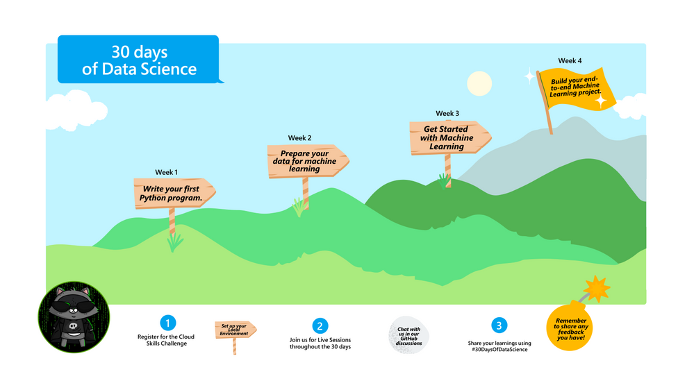

<head>
  <meta name="twitter:url" content="https://microsoft.github.io/30daysof/docs/roadmaps/data-science" />
    <meta name="twitter:title" content="30DaysOfDataScience-  Data preparation and visualization." />
  <meta name="twitter:description" content="Our goal is to guide you through understanding data and using the knowledge to make decisions such as fraud detection, customer segmentation and product pricing." />
  <meta name="twitter:image" content="/img/twitter.png" />
  <meta name="twitter:card" content="summary_large_image" />
  <meta name="twitter:creator" content="@bethanyjep" />
  <meta name="twitter:site" content="@AzureAdvocates" /> 
  <link rel="canonical" href="https://aka.ms/http://aka.ms/30DaysDataScience" />
</head>

## Where to find us

 * [Blog](/blog) - subscribe to the [feed](/blog/rss.xml) for announcements & updates
 * [Roadmap](/docs/roadmaps/data-science) - Our 30 Day schedule
 * [Discussions](https://aka.ms/30DS-Discuss) - ask questions, interact with peers, show-and-tell!

---

# Why Data Science?

Data Science is a combination of domain knowledge, programming and mathematics that enables us to make sense of data. The main goal of Data Science is to understand data, find some hidden relationships and build a model.

Data comes in different types and forms, therefore the first step is to collect and acquire your data. This can be either through going out to the field to collect the data you need, utilizing already existing datasets, scraping data from different sites and many more. After collecting data you then store in order to query it for future use.

**Real world data is messy.** Therefore, we will need to clean and prepare our data first before creating models. Additionally, using visualizations, we can gain deeper understanding of our data that will guide us in knowing the right variables to create our models.

> In this week, we will cover all this, using libraries such as *numpy*, *pandas*, *seaborn* and *matplotlib* to make sense of our data before we are able to create models.

## Week 2: self-study resources
This week we continue the journey with an introduction to Data Science, preparing your data and finally storytelling with Data using Visualization. Get Ready:

:::info WEEK 2 RESOURCES
* October 24: [Introduction to Data Science and Data Preparation](https://aka.ms/analyseData) - [Lesson Dataset](https://aka.ms/pumpkinsDataset )
* October 25: [Data cleaning and transformation techniques](https://microsoft.github.io/Data-Science-For-Beginners/#/2-Working-With-Data/08-data-preparation/README)
* October 26: [Data visualization with Matplotlib](https://aka.ms/manipulateData)
* October 27: [Advanced Data Visualization](https://microsoft.github.io/Data-Science-For-Beginners/#/3-Data-Visualization/README)
* October 28: [Task: Analyzing your data](https://microsoft.github.io/Data-Science-For-Beginners/#/4-Data-Science-Lifecycle/15-analyzing/README) - [Task Dataset](https://aka.ms/spamdataset)
* October 29: [Data Science in the Cloud](https://aka.ms/30DL-dscloud)
* October 30: [Catch up and reflect with the week's learning.](https://techcommunity.microsoft.com/t5/educator-developer-blog/setting-up-python-for-data-science-environments/ba-p/3557884?WT.mc_id=academic-76398-bethanycheum)
:::

## Register and Attend Week 2 Live Sessions
<iframe width="560" height="315" src="https://www.youtube.com/embed/w2cx9BEiq1U" title="YouTube video player" frameborder="0" allow="accelerometer; autoplay; clipboard-write; encrypted-media; gyroscope; picture-in-picture" allowfullscreen></iframe>

| Date | Time | Session Title | RSVP | Live Link |
|:---|:---|:---|:---| :---| 
|25 October | 1pm GMT | Data Wrangling and Manipulation | [RSVP](https://developer.microsoft.com/en-us/reactor/events/17359/?WT.mc_id=academic-78742-bethanycheum) | [LIVE](https://aka.ms/30DS-session3) |
|27 October | 1pm GMT | Data Visualization | [RSVP](https://developer.microsoft.com/en-us/reactor/events/17376/?WT.mc_id=academic-78742-bethanycheum) | [LIVE](https://aka.ms/30DS-session4) |

:::success  Let's Go - Week 2 🎉
1. If you are yet to **Join the Challenge Today:** Don't be left behind in the learning, this [Cloud Skills Challenge](https://aka.ms/30DS-challenge) contains modules that will give you skills to successfully get started with Python and Azure.

1. **Share what you are learning with fellow learners:** Learning alone can be daunting. Using GitHub discussions, we have made it easy for you to interact and learn with fellow particants. [Drop in and say Hi!](https://aka.ms/30DS-Discuss)  
1. **Keep Learning!**
:::
