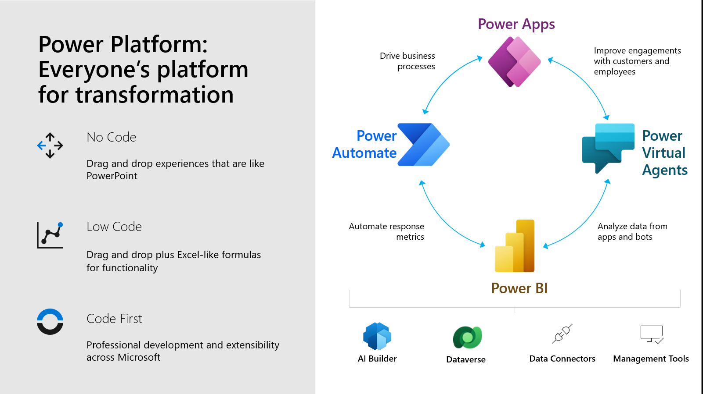
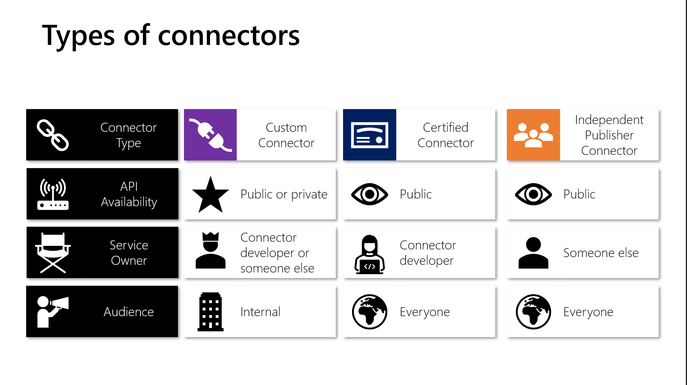

<head>
  <meta name="twitter:url" content="https://microsoft.github.io/30daysof/docs/roadmaps/fusion" />
  <meta name="twitter:title" content="Build-a-custom-connector" />
  <meta name="twitter:description" content="Learn how to build a custom connector from sratch and use it on power automate" />
  <meta name="twitter:image" content="https://microsoft.github.io/30daysof/assets/images/fusion-f731f3ccac8a8ee153416f249d058b46.png" />
  <meta name="twitter:card" content="summary_large_image" />
  <meta name="twitter:creator" content="@juliamuiruri4" />
  <meta name="twitter:site" content="@AzureAdvocates" /> 
  <link rel="canonical" href="https://aka.ms/TheConnectorHackathon" />
</head>

## Hello Day 3! 

Check out what we tackle today. But before that, here is what you have done so far _(You can catch up with the others if you are a step behind ...)_

1. Read the [previous summary blog](https://microsoft.github.io/30daysof/blog/hello-fusion/?WT.mc_id=academic-73999-juliamuiruri)
1. Joined the [Cloud Skills Challenge](https://aka.ms/ConnectorSkillsChallenge)
1. Created a [M365 & Power Apps Developer Account](https://techcommunity.microsoft.com/t5/educator-developer-blog/recap-of-day-2-onboarding-session-30days-of-learning-nigeria/ba-p/3490280?WT.mc_id=academic-0000-juliamuiruri)
1. Talked to us on our [Discussion Forum](https://github.com/microsoft/30daysof/discussions/16) 😇

## Day 3: Summary
We have just built a connector from scratch with you today and I'm sure you agree that it's a fun and easy process, right?  
But why are we doing this? 
### Connector Usecase

---

Team XYZ (a fusion team) comprises of a **Business Manager** (citizen developer building low code solutions on Power Platform), **IT Admin**, **Researcher** and **Pro-Dev**. 
The **Researcher** has identified a new External Service (with a free & public API) that would greatly benefit their Business goals and they would like to access it directly from their system. However, the **Business Manager**, building the low code solutions lacks the coding background to use the API endpoints directly from his solution.
The **Pro-Dev** therefore steps up to fill in the gap by building a connector to wrap the API and publishes it to the organization's environment. The **Business Manager** then uses this connector to access the external service, helping the team hit their business goals and everyone is happy.

---

## What we covered today 

Every person's role on the Power platform towards digital transformation.

What is a connector? **Note: Connectors allow you to not only access Microsoft products, but also external services**

Custom connectors are used to:

- Add services not currently supported
- Expand an exisiting connector that doesn't have the trigger/action you want to use

### Step-by-step - Build a connector
**Step 1:** 📖 Read the Docs/ know the API you want to build a connector for.

**Step 2:** Start in one of the products (Power Apps, Power Automate or Logic Apps). You can choose one of the following options to start building your connector:

1. [Create one from blank](https://docs.microsoft.com/en-us/connectors/custom-connectors/define-blank?WT.mc_id=academic-73999-juliamuiruri). See example of the [SWAPI API (Star wars)](https://youtu.be/CMCuNYVW4B0)
1. Create from Azure Service _(Preview)_ - Super useful when using Azure API Management
1. [Import an OpenAPI File](https://docs.microsoft.com/en-us/connectors/custom-connectors/define-openapi-definition?WT.mc_id=academic-73999-juliamuiruri) (version 2)
1. Import an OpenAPI from URL
1. [Import a Postman collection](https://docs.microsoft.com/en-us/connectors/custom-connectors/define-postman-collection?WT.mc_id=academic-73999-juliamuiruri). Learn how to [Create a Postman collection for a custom connector](https://docs.microsoft.com/en-us/connectors/custom-connectors/create-postman-collection?WT.mc_id=academic-73999-juliamuiruri)
1. Import from GitHub

**Step 3:** 🔐 Set up the Authentication

**Step 4:** ⚡Define the operations (triggers/actions) for your connector. The action you want to create **MUST** be implemented by the API

**Step 5:** [Add code if needed](https://docs.microsoft.com/en-us/connectors/custom-connectors/write-code?WT.mc_id=academic-73999-juliamuiruri) (for now C# code is supported)

**Step 6:** ✅ Save and test your connector

⚠️ _When you build your connector, ensure you hit **save button** to avoid loosing all your work_
📝 If you want your connector to be used across different environments, create it within a solution

Finally. these tools will help you build connectors:
- [Paconn CLI](https://docs.microsoft.com/en-us/connectors/custom-connectors/paconn-cli?WT.mc_id=academic-73999-juliamuiruri) - Add ALM (_Application Lifecycle Management_) to your custom connector
- [Power Platform Connectors VS Code extension](https://aka.ms/ppc-vscode)
- [Power Platform CLI](https://aka.ms/powerplatformcli)

### Next Steps
- Head over to https://make.powerautomate.com/ and start today!

- Explore resources shared on the [presentation deck](https://github.com/microsoft/30daysof/discussions/16#discussioncomment-3650396)

- Build your first connector, share on Social media and tag us to celebrate your learning!

Read [Next Summary Blog](https://microsoft.github.io/30daysof/blog/fusion-build-a-connector-from-OpenAPI-file/?WT.mc_id=academic-73999-juliamuiruri)
:::success READY? LET'S GO! 🎉
Day 4 (Thursday) >> Self paced learning & discussions on GitHub!

Day 5 (Friday) >> Join us for a part 2 Demo
:::