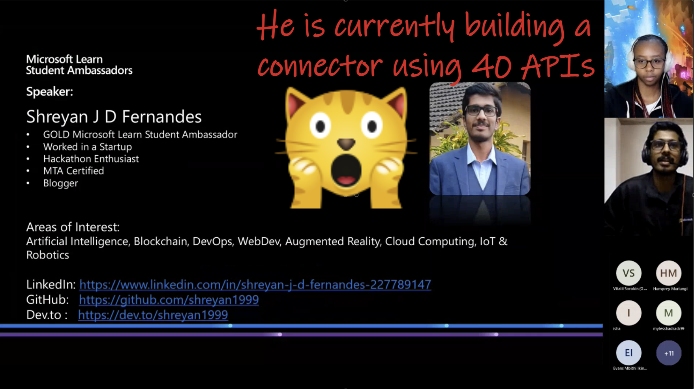
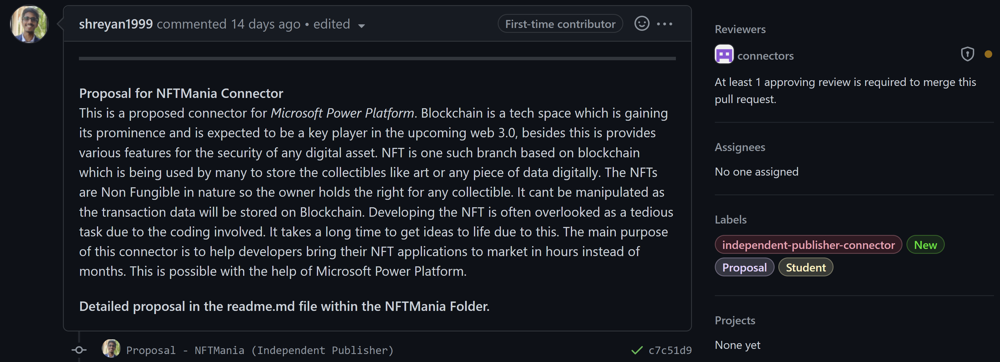
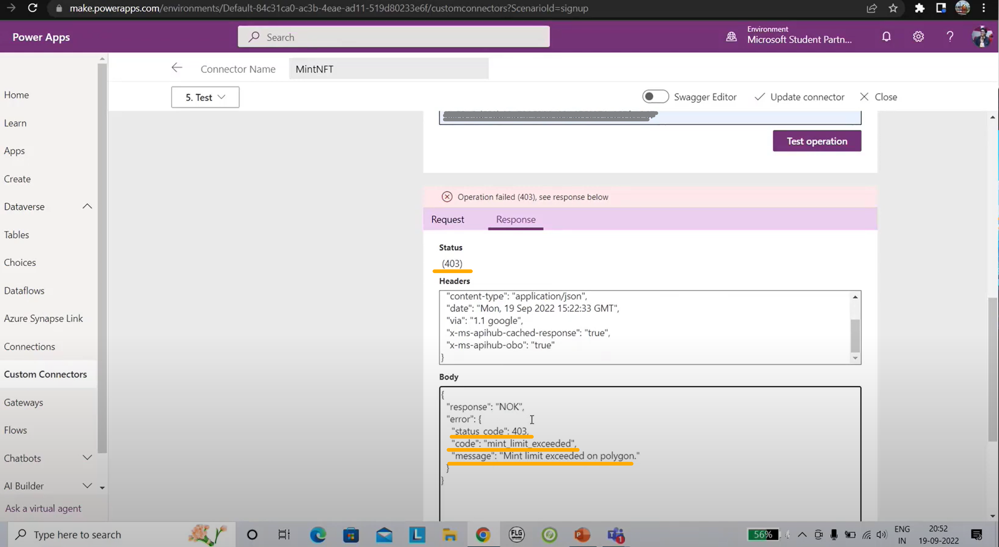

<head>
  <meta name="twitter:url" content="https://microsoft.github.io/30daysof/docs/roadmaps/fusion" />
  <meta name="twitter:title" content="How-Shreyan-Built-The-NFTMania-Connector" />
  <meta name="twitter:description" content="Join us SHREYAN FERNANDED as he shares his experience building and submitting a custom connector" />
  <meta name="twitter:image" content="https://microsoft.github.io/30daysof/assets/images/intro-slide-2ef0844315acf6f541caf5869da84f51.png" />
  <meta name="twitter:card" content="summary_large_image" />
  <meta name="twitter:creator" content="@juliamuiruri4" />
  <meta name="twitter:site" content="@AzureAdvocates" /> 
  <link rel="canonical" href="https://aka.ms/TheConnectorHackathon" />
</head>

## Hello Day 8! 

Today, we have something special for you! But before we dive straight into it, this is what you have done so far _(You can catch up with the others if you are a step behind ...)_

1. Read the [previous summary blog](https://microsoft.github.io/30daysof/blog/fusion-build-a-connector-from-OpenAPI-file/?WT.mc_id=academic-73999-juliamuiruri)
1. Joined the [Cloud Skills Challenge](https://aka.ms/ConnectorSkillsChallenge)
1. Created a [M365 & Power Apps Developer Account](https://techcommunity.microsoft.com/t5/educator-developer-blog/recap-of-day-2-onboarding-session-30days-of-learning-nigeria/ba-p/3490280?WT.mc_id=academic-0000-juliamuiruri)
1. Signed in to https://make.powerautomate.com/ or https://make.powerapps.com/ and attempted your first connector. [See how to start on the SWAPI connector here](https://youtu.be/CMCuNYVW4B0)
1. Talked to us on our [Discussion Forum](https://github.com/microsoft/30daysof/discussions/16) 😇
1. [Provided any product feedback](https://github.com/microsoft/30daysof/discussions/16#discussioncomment-3650962) from the documentation, services, tools that you have used throughout the program. _(Is any learning material missing? Is the documentation difficult to understand? Are you getting unexplained errors? Is anything not working? **Let us know about it**)_

## Day 8: Summary

Meet Shreyan Fernandes, a [Gold Student Ambassador](https://studentambassadors.microsoft.com/?WT.mc_id=academic-0000-juliamuiruri), who shares his incredible journey on how he solved a real-world problem 🦸‍♂️ by building a custom connector 

Connect with Shreyan [on LinkedIn](https://www.linkedin.com/in/shreyan-j-d-fernandes-227789147/) and [Dev.to](https://dev.to/shreyan1999) today for more inspiration

😎 Fun Fact: **He is currently working on updating a connetor that uses 40 APIs!!**

## What was the motive behind his idea?
**_"The motivation to buid this connector came from a real world incident"_**, says Shreyan.

### Problem

Problem 2: **Piracy issues** _Example: Artists having their lyrics/ tones reproduced without their consent!_

### Solution

### Are you thinking of building your first connector today? Here are some tips for you!
1. Always have a motive for building a connector. In this case, Shreyan found a way to not only help himself, but to also help others who might face similar problems. _Solving a problem for many in a creative way_😃
1. You are **likely to encounter errors** while building your connector. Don't let this dishearten you - everyone faces them. Instead, when you get an error while testing your connector,
    - Visit the Response Body to read more on the error
    
    - Search the error online and there is a 95% chance that someone faced it before and posted the solution. See [discussions from other connector creators](https://github.com/microsoft/PowerPlatformConnectors/discussions?WT.mc_id=academic-73999-juliamuiruri)
1. Debugging becomes a lot easier on Postman as compared to doing it on power platform. Once everything works on Postman, it can take you as little as 5 minutes to create the connector
1. If you don't understand the API you want to build a connector for, it becomes extremely difficult to build it successfully. For example, if your API requires Authentication, be extra keen on where the authorization takes place. Is it added to the header, body, query params ...?

### Next Steps
- Head over to https://make.powerautomate.com/ and start today!

- Hear more from Shreyan himself on [YouTube](https://youtu.be/fShDeY7jmog)

- Build your first connector, share on Social media and tag us to celebrate your learning!

:::success READY? LET'S GO! 🎉
Day 11 (Thursday) >> Join us for a session on validating your connector before submitting it to GitHub
:::