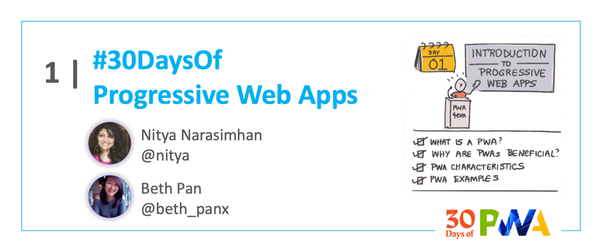
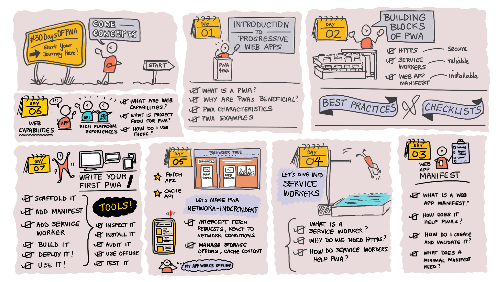
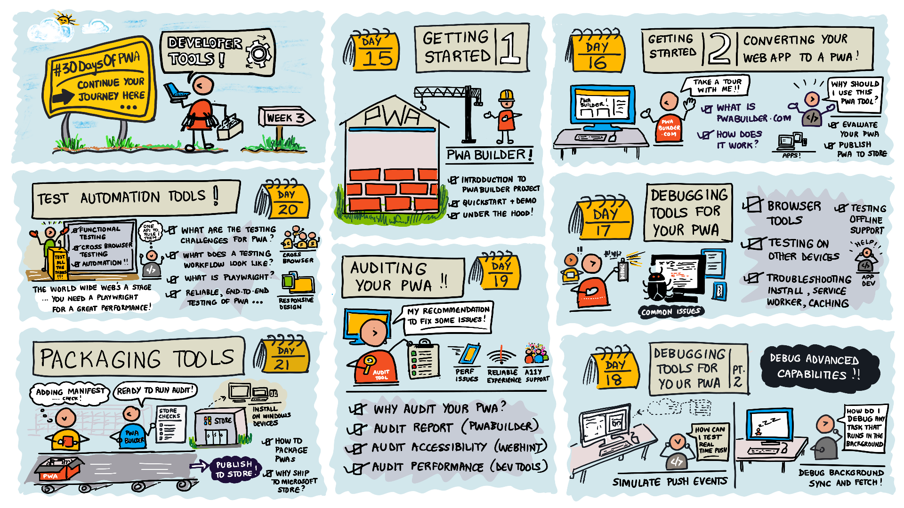

# Roadmap

 

:::success #30DaysOf - PROGRESSIVE WEB APPS
This 30Days Skilling content helps you learn to build and ship [Progressive Web Apps](https://docs.microsoft.com/en-us/microsoft-edge/progressive-web-apps-chromium/) - modern web apps that are installable, reliable, and extensible to work across platforms.

 * Read the ['Kickoff'](#kickoff) section for more details.
 * Meet The ['Team'](#meet-the-team) behind this project.
 * Explore the linked resources each week to skill up!
:::

## Kickoff 

From Feb-Mar 14th, 2022, over 30 days, we published articles that aimed to introduce developers to [Progressive Web Apps](https://docs.microsoft.com/en-us/microsoft-edge/progressive-web-apps-chromium/. 
 * The content covers 0-level to 200-level topics. 
 * Each post should take you 5-10 minutes to read.
 * Each is followed by a sample snippet or exercise. 

You will need some basic web development knowledge to follow along. We hope that beginners will quickly pick up the content and that experts will also learn a few new things.

The Roadmap is structured into 4 themed weeks:

* **Core Concepts**: Learn the fundamentals of PWA.
* **Advanced Capabilities**: Know Project Fugu and relevant APIs.
* **Developer Tools**: Explore end-to-end tooling support for PWA.
* **Platforms & Practices**: Adopt best practices for PWA.

## Week 1: Core Concepts

:::info WEEK 1 
1. [Introduction to Progressive Web Apps](https://microsoft.github.io/win-student-devs/#/30DaysOfPWA/core-concepts/01)
2. [Building Blocks: Core Components of PWAs](https://microsoft.github.io/win-student-devs/#/30DaysOfPWA/core-concepts/02)
3. [HTTPS: Make PWAs Secure](https://microsoft.github.io/win-student-devs/#/30DaysOfPWA/core-concepts/03)
4. [Service Workers: Make PWAs Reliable, Work Offline](https://microsoft.github.io/win-student-devs/#/30DaysOfPWA/core-concepts/04)
5. [Web App Manifest: Make PWAs Installable](https://microsoft.github.io/win-student-devs/#/30DaysOfPWA/core-concepts/05)
6. [Web Capabilities: Drive Rich Platform Experiences](https://microsoft.github.io/win-student-devs/#/30DaysOfPWA/core-concepts/06)
7. [QuickStart: Build and Audit Your First PWA](https://microsoft.github.io/win-student-devs/#/30DaysOfPWA/core-concepts/07)
:::

## Week 2: Advanced Capabilities

:::info WEEK 2
1. [Advanced Capabilities of Progressive Web Apps](https://microsoft.github.io/win-student-devs/#/30DaysOfPWA/advanced-capabilities/01)
2. [Creating Application Shortcuts](https://microsoft.github.io/win-student-devs/#/30DaysOfPWA/advanced-capabilities/02)
3. [Sharing Content from and with Your App](https://microsoft.github.io/win-student-devs/#/30DaysOfPWA/advanced-capabilities/03)
4. [Display Content in the Title Bar](https://microsoft.github.io/win-student-devs/#/30DaysOfPWA/advanced-capabilities/04)
5. [Caching Your App’s Data](https://microsoft.github.io/win-student-devs/#/30DaysOfPWA/advanced-capabilities/05)
6. [Synchronizing App Data in the Background](https://microsoft.github.io/win-student-devs/#/30DaysOfPWA/advanced-capabilities/06)
7. [Notifying Your Users of Updates](https://microsoft.github.io/win-student-devs/#/30DaysOfPWA/advanced-capabilities/07)
:::

## Week 3: Developer Tools

:::info WEEK 3
1. [Getting Started Tools](https://microsoft.github.io/win-student-devs/#/30DaysOfPWA/dev-tools/01)
2. [Authoring Tools](https://microsoft.github.io/win-student-devs/#/30DaysOfPWA/dev-tools/02)
3. [Debugging Tools (Part 1)](https://microsoft.github.io/win-student-devs/#/30DaysOfPWA/dev-tools/03)
4. [Debugging Tools (Part 2)](https://microsoft.github.io/win-student-devs/#/30DaysOfPWA/dev-tools/04)
5. [Auditing Tools](https://microsoft.github.io/win-student-devs/#/30DaysOfPWA/dev-tools/05)
6. [Test Automation Tools](https://microsoft.github.io/win-student-devs/#/30DaysOfPWA/dev-tools/06)
7. [Packaging Tools](https://microsoft.github.io/win-student-devs/#/30DaysOfPWA/dev-tools/07)
:::

## Week 4: Platforms and Practices

:::info WEEK 4
1. [Installability for PWAs](https://microsoft.github.io/win-student-devs/#/30DaysOfPWA/platforms-practices/01)
2. [Best Practices for PWA Engagement](https://microsoft.github.io/win-student-devs/#/30DaysOfPWA/platforms-practices/02)
3. [Distributing Your PWA](https://microsoft.github.io/win-student-devs/#/30DaysOfPWA/platforms-practices/03)
4. [Best Practices for PWA Reliability](https://microsoft.github.io/win-student-devs/#/30DaysOfPWA/platforms-practices/04)
5. [PWAs and Maintainability](https://microsoft.github.io/win-student-devs/#/30DaysOfPWA/platforms-practices/05)
6. [PWA Maintainability Part 2: Web Component](https://microsoft.github.io/win-student-devs/#/30DaysOfPWA/platforms-practices/06)
7. [Best Practices for PWA UI/UX](https://microsoft.github.io/win-student-devs/#/30DaysOfPWA/platforms-practices/07)
:::

## Meet The Team

This was a multi-team effort from folks across the Microsoft Edge, Windows, and Developer Relations teams. You will find the [participants listed on the website](https://microsoft.github.io/win-student-devs/#/30DaysOfPWA/kickoff?id=brought-to-you-by) and you can find their social profiles by [exploring the posts on dev.to](https://dev.to/nitya/series/16849). For now, here's the team photo!

