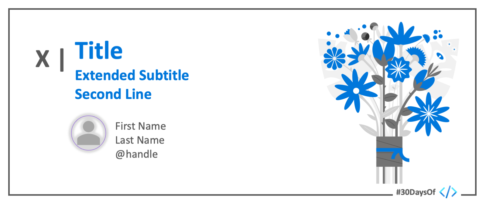

# Roadmap

 

:::success #30DaysOf - PROGRESSIVE WEB APPS
This 30Days Skilling content helps you learn to build and ship [Progressive Web Apps](https://docs.microsoft.com/en-us/microsoft-edge/progressive-web-apps-chromium/) - modern web apps that are installable, reliable, and extensible to work across platforms.

 * Read the ['Kickoff'](#kickoff) section for more details.
 * Meet The ['Team'](#meet-the-team) behind this project.
 * Explore the linked resources each week to skill up!
:::

## Kickoff 

## Week 1: Theme

:::info WEEK 1 
 1.
 2.
 3.
 4.
 5.
 6.
 7.
:::

## Week 2: Theme

:::info WEEK 2
 1.
 2.
 3.
 4.
 5.
 6.
 7.
:::

## Week 3: Theme

:::info WEEK 3
 1.
 2.
 3.
 4.
 5.
 6.
 7.
:::

## Week 4: Theme

:::info WEEK 4
 1.
 2.
 3.
 4.
 5.
 6.
 7.
:::

## Meet The Team
