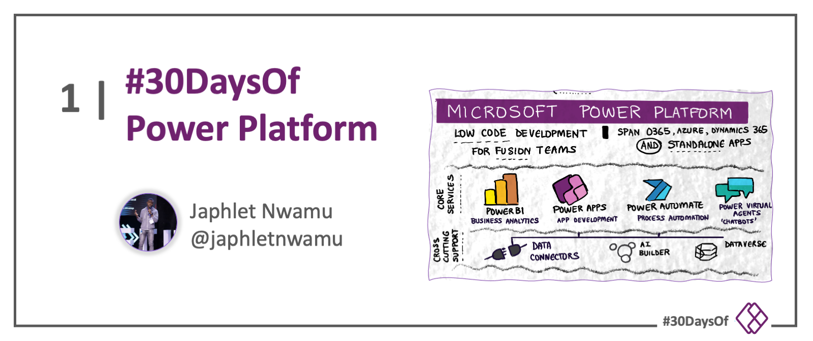

 

# Roadmap

:::success #30DaysOf - Power Platform
This is a 30days learning curriculum curated by Cloud Advocates at Microsoft focused on empowering you with the knowledge and resources to build enterprise applications, automate processes, build beautiful external-facing websites and build intelligent bots without code within minutes using Microsoft's Power Platform.
:::

---

## Motivation

Did you know? According to IDC, by 2025, 500 million more apps will need to be created. That’s more than all the apps we have built in the last 40 years. On the brighter side, this presents us with an enormous opportunity.

Sadly, there aren’t enough professional code-first developers to go around for the volume of work ahead to modernize businesses. Developers are already slammed with a long technology to-do list of tasks and are being asked to fundamentally reinvent how the business works. 

To bridge this gap and reduce the workload, many developers and organizations have relied on low-code and automation. The rate of such automations will increase at a faster rate in the next 5 years, and we need to get you ready for this.

---

## Introduction
Microsoft's Power Platform is a low-code and automation tool built to empower everyone to build solutions, regardless of their coding abilities. 

It consists of 5 powerful tools:
1. **Power Apps**: Used by 92% of the Fortune 500 organizations, Power Apps enables you build enterprise applications within minutes without writing a single line of code
2. **Power Automate**: With the ability to now connect to 750+ applications and services, Power Automate enables you automate repetitive and time-consuming tasks and processes.
3. **Power BI**: Named Leader of Gartner's Magic Quadrant for Business Intelligence and Analytics Platforms since 2018, Power BI enables you visualize, analyse and derive meaningful insights from data. 
4. **Power Pages**: This new member of the Power Platform family empowers you with the ability to build beautiful external facing web applications.
5. **Power Virtual Agents**: Used by businesses big and small around the world as well as government orgnaizations, Power Virtual Agents allows you build intelligent conversational bots without writing code.

---

## Kickoff

:::info ONBOARDING RESOURCES
Get started by familiarizing yourself with the [Onboarding Resources](https://aka.ms/Pre30DL) for this #30DaysOfLearning.
:::

This #30Days sprint covers Power Apps, Power Automate, Power Virtual Agents & Power Pages. 
 * Explore Power BI with the [**Data Analytics Roadmap**](./06-data-analytics.md).
 * Explore Data Connectors with the [**Fusion Roadmap**](./04-fusion.md)

Ready to begin building with Microsoft's Power Platform? 
Let's go!

---

## Week 1: Fundamentals
This week, learn how to setup your development environment. You also get to learn about tools that makes it easy to store your data securely while using Power Platform.

:::info WEEK 1 
1. [Introduction to Microsoft's Power Platform​](http://aka.ms/30DL-PowerPlatformDay1) (video) -- watch [Q&A](https://youtu.be/sNtkfyt8WSE) (video)
2. [Introduction to Dataverse and SharePoint](http://aka.ms/30DL-PowerPlatformDay2) (video) -- watch [Q&A](https://youtu.be/1feWyHQwZhc) (video)
3. [Introduction to Power Virtual Agents](https://aka.ms/30DL-PowerPlatformDay3) (video)
4. [Introduction to Power Automate](http://aka.ms/30DL-PowerPlatformDay5) (video)
5. [Introduction to Power Apps](http://aka.ms/30DL-PowerPlatformDay10) (video)
6. [How to get a Microsoft Certification for Free as a Student](https://techcommunity.microsoft.com/t5/educator-developer-blog/how-to-get-a-microsoft-certification-for-free-as-a-student/ba-p/3584897/?WT.mc_id=academic-76398-japhletnwamu) (blog)
7. [Learn about the Microsoft Learn Student Ambassador Program](http://aka.ms/aboutmlsaprogram) (video)
:::

---

## Week 2: Learning by Doing
This week, we try out.

:::info WEEK 2 
1. [Building a Simple Virtual Agent Solution](http://aka.ms/30DL-PowerPlatformDay4) (video)
2. [Building an Automated Solution - Part 1](http://aka.ms/30DL-PowerPlatformDay8) (video)
3. [Building an Automated Solution - Part 2](http://aka.ms/30DL-PowerPlatformDay9) (video)
4. [Building a Canvas Application with Power Apps](http://aka.ms/30DL-PowerPlatformDay11) (video)
5. [Building a Model-Driven Application with Power Apps](http://aka.ms/30DL-PowerPlatformDay12) (video)
6. [Building with Power Pages](http://aka.ms/30DL-PowerPlatformDay15) (video)
7. [Build a Community Website with Power Pages](https://techcommunity.microsoft.com/t5/educator-developer-blog/build-a-community-website-with-power-pages/ba-p/3576465/?WT.mc_id=academic-76398-japhletnwamu) (blog)
:::

---

## Week 3: Connecting the Dots
"Powerful Alone, Better Together!" This week, we connect the different parts of Power Platform. At the end of this week, we would have built a complete solution with Microsoft's Power Platform.

:::info WEEK 3 
1. [Connecting the Dots - Bringing Power Virtual Agents Home](http://aka.ms/30DL-PowerPlatformDay17) (video)
2. [Connecting the Dots - Bringing Power Automate Home](http://aka.ms/30DL-PowerPlatformDay18) (video)
3. [Connecting the Dots - Bringing Power Apps Home](http://aka.ms/30DL-PowerPlatformDay19) (video)
4. [Building Applications Made Easy with Express Design in Power Apps](http://aka.ms/PowerAppsExpressDesign) (blog)
5. [Building Accessible Applications with Microsoft's Power Platform](http://aka.ms/BuildAccessibleApps) (video)
6. [Building an Accessible Quiz Application without Code with Microsoft's Power Platform](https://techcommunity.microsoft.com/t5/educator-developer-blog/building-an-accessible-application-with-power-platform/ba-p/3549935) (blog)
7. [Differences between PowerApps Portals and Power Pages](https://techcommunity.microsoft.com/t5/educator-developer-blog/differences-between-powerapps-portals-and-power-pages/ba-p/3571229/?WT.mc_id=academic-76398-japhletnwamu) (blog)

:::

---

## Week 4: Time to Develop Yourself and Build!
Here's an opportunity for you learn how to position yourself for opportunities in tech and build relevant solutions to problems affecting you or your immediate environment with Power Platform.

:::info WEEK 4
1. Capstone Project - Utilizing Power Platform, you are expected to think of a problem affecting your immediate environment and build a solution. 
2. Capstone Project - [Get Inspired by Projects Built with Power Platform](http://aka.ms/ppsamples)
3. Capstone Project - [Sample Solution Built with Microsoft Power Platform](http://aka.ms/30DL-SampleProject)
4. [Optimizing your LinkedIn Profile](http://aka.ms/30DLTidyUp)
5. [Tips on How to Get Noticed by Prospective Employers](https://aka.ms/HowtoGetNoticed)
6. Learn skills to prepare you for the future at [Microsoft Student Hub](https://docs.microsoft.com/en-us/training/student-hub/?WT.mc_id=academic-76398-japhletnwamu)
7. Capstone Project - We would love to see what solution you have developed. Share your solution on social media using the hashtags _#30DaysOfPowerPlatform_ and _#PowerAddict_. And don't forget to continue developing yourself.

:::

---

## Meet The Team

Check back to learn more about the team behind this initiative!