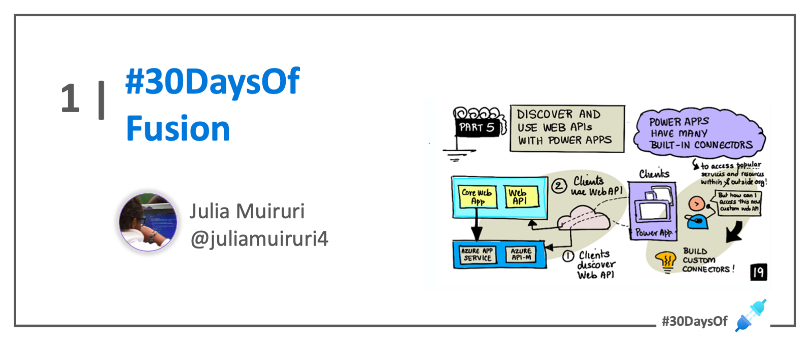

 

# Roadmap

:::success #30DaysOf - Fusion Development
This 30Days Skilling content is a gamified, learning experience for fusion developers to compete in building custom connectors for the power platform based on the [**Top Connector Asks**](https://github.com/microsoft/PowerPlatformConnectors/wiki/Top-Connector-Asks?WT.mc_id=academic-73999-juliamuiruri).

 * Read the ['Kickoff'](#kickoff) section for more details.
 * Meet The ['Team'](#meet-the-team) behind this project.
 * Explore the linked resources each week to skill up!
:::

 
## Kickoff 
Organizations today are embracing ‘fusion development’ to drive digital transformation in their businesses. A fusion development team brings together Pro Devs, IT admins, citizen Devs, researchers, and business managers to collaborate in building transformative technological solutions. 

This #30DaysOfFusion - Microsoft Connector Hackathon Pilot Program, welcomes you to contribute in building power platform connectors that will make it possible for low code developers to connect to as many external data sources as they would need.

## Week 1: The Challenge Begins!

:::info WEEK 1 SCHEDULE
 * **Sep 12** - Kickoff Meeting! Join the [**🔌Connector Skills Challenge**](https://aka.ms/ConnectorSkillsChallenge)
 * **Sep 13** - _Self Paced Learning_
 * **Sep 14** - **Live Session**: Build A Connector Live!
 * **Sep 15** - _Self Paced Learning_
 * **Sep 16** - **Office Hour**: QnA Session
:::

⚡️ **RESOURCES:**

 * How to set up [M365 Developer Account](https://techcommunity.microsoft.com/t5/educator-developer-blog/recap-of-day-2-onboarding-session-30days-of-learning-nigeria/ba-p/3490280?WT.mc_id=academic-0000-juliamuiruri) and [Power Apps Developer Plan](https://techcommunity.microsoft.com/t5/educator-developer-blog/recap-of-day-2-onboarding-session-30days-of-learning-nigeria/ba-p/3490280?WT.mc_id=academic-0000-juliamuiruri)
 * SWAPI API Connector in action - [Building the connector from scratch and using it in a Power App](https://youtu.be/CMCuNYVW4B0)
 * [Independent Publisher Step by step Guide](https://www.youtube.com/watch?v=wGFWZqsxIBQ)
 * [Extend an OpenAPI definition for a custom connector](https://docs.microsoft.com/en-us/connectors/custom-connectors/openapi-extensions?WT.mc_id=academic-73999-juliamuiruri)

## Week 2: Let's Build Together

:::info WEEK 2 SCHEDULE
 * **Sep 19** - **Office Hour**: QnA Session
 * **Sep 20** - _Self Paced Learning_
 * **Sep 21** - _Self Paced Learning_
 * **Sep 22** - **Live Session**: Validate your Connector before submission
 * **Sep 23** - _Self Paced Learning_

The [**🔌 Connector Skills Challenge**](https://aka.ms/ConnectorSkillsChallenge) is still on!
:::

⚡️ **RESOURCES** 
* Gear up: [Connector Builder Tools](https://github.com/microsoft/PowerPlatformConnectors/discussions/1416?WT.mc_id=academic-73999-juliamuiruri)
* [Create a custom connector from scratch](https://docs.microsoft.com/en-us/connectors/custom-connectors/define-blank?WT.mc_id=academic-73999-juliamuiruri)
* [Microsoft Power Platform Connectors CLI](https://docs.microsoft.com/en-us/connectors/custom-connectors/paconn-cli?WT.mc_id=academic-73999-juliamuiruri)
* [Coding Standards](https://docs.microsoft.com/en-us/connectors/custom-connectors/coding-standards?WT.mc_id=academic-73999-juliamuiruri)

## Week 3: Submit your connector proposal

:::info WEEK 3 SCHEDULE
 * **Sep 26** - **Submit Your Connector Proposal**: Find Your Team!
 * **Sep 27** - _Self Paced Learning_
 * **Sep 28** - _Self Paced Learning_
 * **Sep 29** - **Live Session**: Submit your Connector on GitHub
 * **Sep 30** - _Self Paced Learning_

The [**🔌 Connector Skills Challenge**](https://aka.ms/ConnectorSkillsChallenge) is still on!
:::

⚡️ **RESOURCES**
* Gear up: [Independent Publisher Certification process](https://docs.microsoft.com/en-us/connectors/custom-connectors/certification-submission-ip?WT.mc_id=academic-73999-juliamuiruri)
* [Data protection in connectors](https://docs.microsoft.com/en-us/connectors/protection?WT.mc_id=academic-73999-juliamuiruri)
* [Get your connector certified](https://docs.microsoft.com/en-us/connectors/custom-connectors/submit-certification?WT.mc_id=academic-73999-juliamuiruri)

## Week 4: Ready? Steady ..

:::info WEEK 4 SCHEDULE
 * **Oct 03** - **Office Hour**: QnA Session
 * **Oct 04** - _Self Paced Learning_
 * **Oct 05** - _Self Paced Learning_
 * **Oct 06** - **Live Session**: AMA - All you need to know, to participate!
 * **Oct 07** - **See you at the Student Summit!** [🎉 _Join us in your Region_](https://lnkd.in/dr2yja8s)

The [**🔌 Connector Skills Challenge**](https://aka.ms/ConnectorSkillsChallenge) is still on!
:::

## Week 5: Go! ...

:::info WEEK 4 SCHEDULE

 * **Oct 10** - 🧰 **Hackathon Day 1**
 * **Oct 11** - 🧰 **Hackathon Day 2**
 * **Oct 12** - The [**🔌 Connector Skills Challenge**](https://aka.ms/ConnectorSkillsChallenge) is still on!
 * **Oct 13** - The [**🔌 Connector Skills Challenge**](https://aka.ms/ConnectorSkillsChallenge) is still on!
 * **Oct 14** - 🏆 **Official Close Of Cloud Skills Challenge**

:::

## Meet The Team

Check back to learn more about the team behind this initiative!