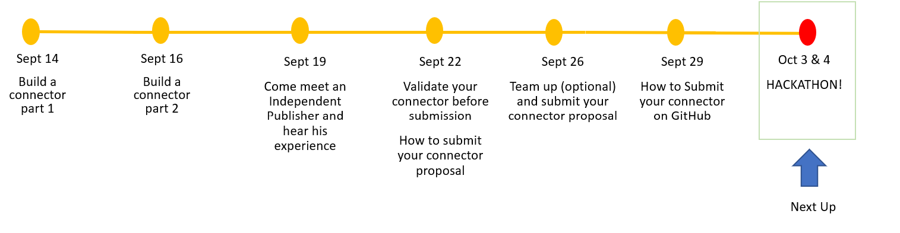
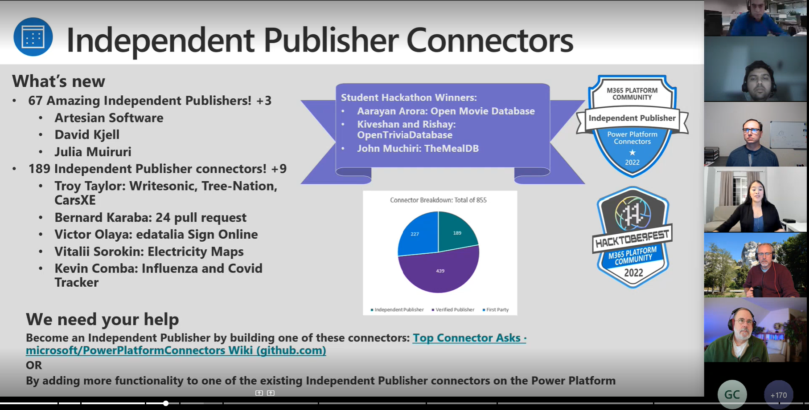

 

# Roadmap

:::success #30DaysOf - Fusion Development
This 30Days Skilling content is a gamified, learning experience for fusion developers to compete in building custom connectors for the power platform based on the [**Top Connector Asks**](https://github.com/microsoft/PowerPlatformConnectors/wiki/Top-Connector-Asks?WT.mc_id=academic-73999-juliamuiruri).

 * Read the ['Kickoff'](#kickoff) section for more details.
 * Meet The ['Team'](#meet-the-team) behind this project.
 * Explore the linked resources each week to skill up!
:::

 
## Kickoff 
Organizations today are embracing ‘fusion development’ to drive digital transformation in their businesses. A fusion development team brings together Pro Devs, IT admins, citizen Devs, researchers, and business managers to collaborate in building transformative technological solutions. 

This #30DaysOfFusion - Microsoft Connector Hackathon Pilot Program, welcomes you to contribute in building power platform connectors that will make it possible for low code developers to connect to as many external data sources as they would need.

 
## Week 1: The Challenge Begins!

:::info WEEK 1 SCHEDULE
 * **Sep 12** - Kickoff Meeting! Join the [**🔌Connector Skills Challenge**](https://aka.ms/ConnectorSkillsChallenge)
 * **Sep 13** - _Self Paced Learning_
 * **Sep 14** - **Live Session**: Build A Connector Live!
 * **Sep 15** - _Self Paced Learning_
 * **Sep 16** - **Office Hour**: Build and Consume a Connector from a Power App
:::

⚡️ **RESOURCES:**

 * How to set up [M365 Developer Account](https://techcommunity.microsoft.com/t5/educator-developer-blog/recap-of-day-2-onboarding-session-30days-of-learning-nigeria/ba-p/3490280?WT.mc_id=academic-0000-juliamuiruri) and [Power Apps Developer Plan](https://techcommunity.microsoft.com/t5/educator-developer-blog/recap-of-day-2-onboarding-session-30days-of-learning-nigeria/ba-p/3490280?WT.mc_id=academic-0000-juliamuiruri)
 * SWAPI API Connector in action - [Building the connector from scratch and using it in a Power App](https://youtu.be/CMCuNYVW4B0)
 * [Independent Publisher Step by step Guide](https://www.youtube.com/watch?v=wGFWZqsxIBQ)
 * [Extend an OpenAPI definition for a custom connector](https://docs.microsoft.com/en-us/connectors/custom-connectors/openapi-extensions?WT.mc_id=academic-73999-juliamuiruri)

## Week 2: Let's Build Together

:::info WEEK 2 SCHEDULE
 * **Sep 19** - **Office Hour**: Come meet an Independent Publisher
 * **Sep 20** - _Self Paced Learning_
 * **Sep 21** - _Self Paced Learning_
 * **Sep 22** - **Live Session**: How to validate your Connector before submission
 * **Sep 23** - _Self Paced Learning_

The [**🔌 Connector Skills Challenge**](https://aka.ms/ConnectorSkillsChallenge) is still on!
:::

⚡️ **RESOURCES** 
* Gear up: [Connector Builder Tools](https://github.com/microsoft/PowerPlatformConnectors/discussions/1416?WT.mc_id=academic-73999-juliamuiruri)
* [Create a custom connector from scratch](https://docs.microsoft.com/en-us/connectors/custom-connectors/define-blank?WT.mc_id=academic-73999-juliamuiruri)
* [Microsoft Power Platform Connectors CLI](https://docs.microsoft.com/en-us/connectors/custom-connectors/paconn-cli?WT.mc_id=academic-73999-juliamuiruri)
* [Coding Standards](https://docs.microsoft.com/en-us/connectors/custom-connectors/coding-standards?WT.mc_id=academic-73999-juliamuiruri)

## Week 3: Submit your connector proposal

:::info WEEK 3 SCHEDULE
 * **Sep 26** - **Submit Your Connector Proposal**: Find Your Team!
 * **Sep 27** - _Self Paced Learning_
 * **Sep 28** - _Self Paced Learning_
 * **Sep 29** - **Live Session**: How to submit your Connector on GitHub
 * **Sep 30** - _Self Paced Learning_

The [**🔌 Connector Skills Challenge**](https://aka.ms/ConnectorSkillsChallenge) is still on!
:::

⚡️ **RESOURCES**
* Gear up: [Independent Publisher Certification process](https://docs.microsoft.com/en-us/connectors/custom-connectors/certification-submission-ip?WT.mc_id=academic-73999-juliamuiruri)
* [Data protection in connectors](https://docs.microsoft.com/en-us/connectors/protection?WT.mc_id=academic-73999-juliamuiruri)
* [Get your connector certified](https://docs.microsoft.com/en-us/connectors/custom-connectors/submit-certification?WT.mc_id=academic-73999-juliamuiruri)

## Week 4: Ready? Steady? Go ..

:::info WEEK 4 SCHEDULE
 * **Oct 03** - 🧰 **Hackathon Day 1**
 * **Oct 04** - 🧰 **Hackathon Day 2**
 * **Oct 05** - The [**🔌 Connector Skills Challenge**](https://aka.ms/ConnectorSkillsChallenge) is still on!
 * **Oct 06** - The [**🔌 Connector Skills Challenge**](https://aka.ms/ConnectorSkillsChallenge) is still on!
 * **Oct 07** - **See you at the Student Summit!** [🎉 _Join us in your Region_](https://lnkd.in/dr2yja8s)
:::

## Week 5: Wrap up! 

:::info WEEK 5 SCHEDULE
The [**🔌 Connector Skills Challenge**](https://aka.ms/ConnectorSkillsChallenge) is still on!
 * **Oct 10 - 13** - Any improvements/updates for your connector?
 
 * **Oct 14** - 🏆 [**Official Close Of Cloud Skills Challenge**](https://aka.ms/ConnectorSkillsChallenge)

:::

## Program Summary & Next Steps

Thank you all for your participation throughout the 30 days of fusion. We enjoyed helping you understand how you can use your technical skills and understanding of APIs to build Independent Publisher Connectors that could potentially be used by thousands of citizen developers across the globe 😃

:::info The Connector Hackathon Winners 🏆 Congratulations!!
[The Open Movie Database Connector](https://learn.microsoft.com/en-us/connectors/omdbip/) by [Aaryan Arora](https://github.com/aaryan2134) from India

[The Open Trivia Database Connector](https://learn.microsoft.com/en-us/connectors/opentriviadbip/?WT.mc_id=academic-73999-juliamuiruri) by [Kiveshan Naidoo](https://github.com/Kiveshan) from South Africa

The Meal DB Connector _(Deployment-in-progress)_ by [John Muchiri](https://github.com/johnmuchiriM) from Kenya

:::

 Note: Check out the [Microsoft 356 Platform Community](https://pnp.github.io/?WT.mc_id=academic-73999-juliamuiruri) to learn how to build apps on Microsoft 365

And Kudos! to everyone who was able to learn new skills and apply them throughout the program.

Good News!! Your journey doesn't have to end here. We published an article that will guide anyone on [how to build an Independent Publisher connector as a school Capstone project](https://techcommunity.microsoft.com/t5/educator-developer-blog/capstone-project-build-an-independent-publisher-connector/ba-p/3655738). We still need your help to build to build connectors on this [Top Connector Asks](https://github.com/microsoft/PowerPlatformConnectors/wiki/Top-Connector-Asks) List and the resource above provides you with all you will need for each step (blogs, video recordings & documentation).

Additionally, we have a [Student Independent Publisher Community](https://www.linkedin.com/groups/9248828/) on LinkedIn and we welcome you to join us and learn more about how you can use your coding skills to create projects that will help thousands of Power Platform Users.