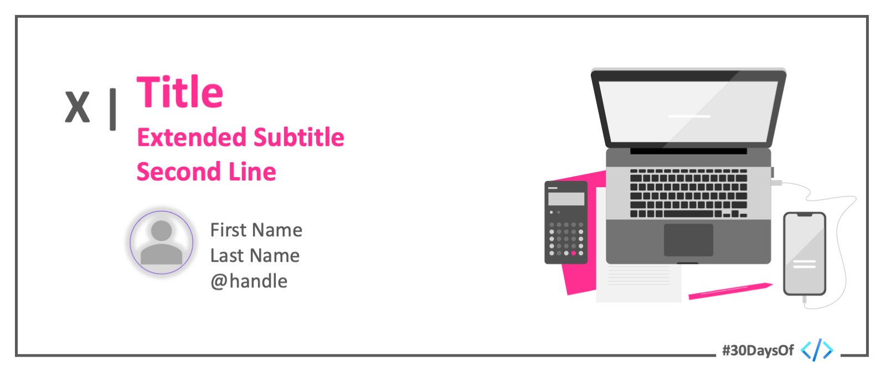

 

# Roadmap

:::success #30DaysOf - Fusion Development
This 30Days Skilling content is a gamified, learning experience for fusion developers to compete in building custom connectors for the power platform based on the [Top Connector Asks](https://github.com/microsoft/PowerPlatformConnectors/wiki/Top-Connector-Asks?WT.mc_id=academic-73999-juliamuiruri).

 * Read the ['Kickoff'](#kickoff) section for more details.
 * Meet The ['Team'](#meet-the-team) behind this project.
 * Explore the linked resources each week to skill up!
:::

 
## Kickoff 
Organizations today are embracing ‘fusion development’ to drive digital transformation in their businesses. A fusion development team brings together Pro Devs, IT admins, citizen Devs, researchers, and business managers to collaborate in building transformative technological solutions. This #30DaysOfFusion - Microsoft Connector Hackathon Pilot Program, welcomes you to contribute in building power platform connectors that will make it possible for low code developers to connect to as many external data sources as they would need.

## Week 1: The Challenge Begins!
:::info WEEK 1 RESOURCES
* Setting up [M365 Developer Account](https://developer.microsoft.com/en-us/microsoft-365/dev-program/?WT.mc_id=academic-73999-juliamuiruri)
* Setting up [Power Apps Developer Plan](https://powerapps.microsoft.com/en-us/developerplan/?WT.mc_id=academic-73999-juliamuiruri)
* [Independent Publisher Step by step Guide](https://www.youtube.com/watch?v=wGFWZqsxIBQ)
* [Extend an OpenAPI definition for a custom connector](https://docs.microsoft.com/en-us/connectors/custom-connectors/openapi-extensions?WT.mc_id=academic-73999-juliamuiruri)
:::

| 12th Sept  | 13th Sept  | 14th Sept  | 15th Sept  | 16th Sept  |
|---|---|---|---|---|
| Official Program Launch RSVP  | _Self-paced learning_  | Live Session: Build & Publish an API on Azure   | _Self-paced learning_    |Live Session: Extend an OpenAPI definition for a custom connector   |
| Join the Challenge: [The Connector Skills Challenge](https://aka.ms/ConnectorSkillsChallenge) |      | RSVP Today!  |   | RSVP Today! |

## Week 2: Let's build a Connector Together!
:::info WEEK 2 RESOURCES
* Gear up: [Connector Builder Tools](https://github.com/microsoft/PowerPlatformConnectors/discussions/1416?WT.mc_id=academic-73999-juliamuiruri)
* [Create a custom connector from scratch](https://docs.microsoft.com/en-us/connectors/custom-connectors/define-blank?WT.mc_id=academic-73999-juliamuiruri)
* [Microsoft Power Platform Connectors CLI](https://docs.microsoft.com/en-us/connectors/custom-connectors/paconn-cli?WT.mc_id=academic-73999-juliamuiruri)
* [Coding Standards](https://docs.microsoft.com/en-us/connectors/custom-connectors/coding-standards?WT.mc_id=academic-73999-juliamuiruri)

:::
| 19th Sept  | 20th Sept  | 21st Sept  | 22nd Sept  | 23rd Sept  |
|---|---|---|---|---|
| Live Session: Build a Connector!   | _Self-paced learning_   |_Self-paced learning_   |  Live Session: Validate your Connector using Paconn!   | _Self-paced learning_   |
| RSVP Today! |   |   | RSVP Today!  |   |

## Week 3: Submit your connector proposal
:::info WEEK 3 RESOURCES
* Gear up: [Independent Publisher Certification process](https://docs.microsoft.com/en-us/connectors/custom-connectors/certification-submission-ip?WT.mc_id=academic-73999-juliamuiruri)
* [Data protection in connectors](https://docs.microsoft.com/en-us/connectors/protection?WT.mc_id=academic-73999-juliamuiruri)
* [Get your connector certified](https://docs.microsoft.com/en-us/connectors/custom-connectors/submit-certification?WT.mc_id=academic-73999-juliamuiruri)

:::
| 26th Sept  | 27th Sept  | 28th Sept  | 29th Sept  | 30th Sept  |
|---|---|---|---|---|
| Submit your connector proposal _(and get yourself a team)_   | _Self-paced learning_   |_Self-paced learning_   |  Live Session: Submit your connector on GitHub!   | _Self-paced learning_   |
| The Challenge is still on: [The Connector Skills Challenge](https://aka.ms/ConnectorSkillsChallenge) |   |   | RSVP Today!  |   |
## Week 4: Ready! Steady ...
| 3rd Oct  | 4th Oct  | 5th Oct  | 6th Oct  | 7th Oct  |
|---|---|---|---|---|
| _Self-paced learning_   | _Self-paced learning_   |_Self-paced learning_   |  Live AMA Session: All you need to know to participate!   | **See you at the Student Summit!**   |
| The Challenge is still on: [The Connector Skills Challenge](https://aka.ms/ConnectorSkillsChallenge) |   |   | RSVP Today!  | [Join us in your Region](https://lnkd.in/dr2yja8s)  |

## Week 5: Go! ...
| 10th Oct  | 11th Oct  | 12th Oct  | 13th Oct  | 14th Oct  |
|---|---|---|---|---|
| HACKATHON DAY 1  |HACKATHON DAY 2   |   |     | Official close of the Cloud Skills Challenge!   |
| Yes, the Challenge still lives: [The Connector Skills Challenge](https://aka.ms/ConnectorSkillsChallenge) |   |   | RSVP Today!  |   |
## Meet The Team