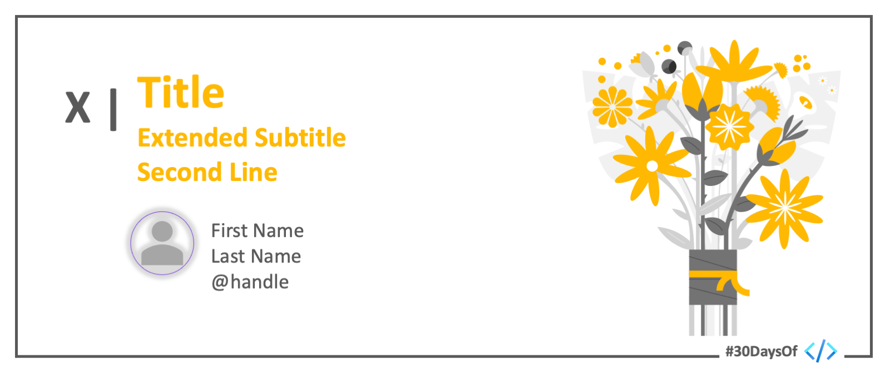

 

# Roadmap

:::success #30DaysOf - Data Science
This 30Days Skilling content provides a guided tour of Data Science and Machine Learning in Python and Azure in four themed weeks.

 * Read the ['Kickoff'](#kickoff) section for more details.
 * Meet The ['Team'](#meet-the-team) behind this project.
 * Explore the linked resources each week to skill up!
:::

## Kickoff 
In the #30DaysOfDataScience we will go from understanding the Python language to working with real life data and finally creating Machine Learning models both on Azure and in Python. The main role is understanding our data and using the knowledge to make decisions such as clustering Nigerian music based on their 'danceability' score, 'acousticness', loudness, 'speechiness', popularity and energy. 

Full curriculum can be found [here](https://techcommunity.microsoft.com/t5/educator-developer-blog/data-science-and-machine-learning-curriculum/ba-p/3503610)

## Week 1: Getting Started with Python
Python is one of the main programming languages used in Data Science. A major advantage of the language is its abundance of libraries which enable you to analyze your data with ease.

:::info WEEK 1 RESOURCES
* Setting up your local environment
* Python basics: operators | data types
* Python basics: loops | dictionaries
* Python basics: functions
* Create your first Python program
:::

## Week 2: Data Preparation and Visualization
Data Science is an intersection of domain knowledge, technical expertise, and statistics. It gives us the power to evaluate existing data, perform various functions such as visualization and manipulation which in turn help us in decision making. 

:::info WEEK 2 RESOURCES
* Introduction to Data Science and Data Preparation
* Data cleaning and transformation techniques
* Data visualization with Matplotlib
* Advanced Data Visualization
* Analyzing your data
* Data Science in the Cloud
:::

## Week 3: Getting Satrted in Machine Learning
Machine learning is often the foundation for an AI system and is the way we "teach" a computer model to make predictions and draw conclusions from data. It automates the process of pattern-discovery by finding meaningful insights from real-world or generated data.

:::info WEEK 3 RESOURCES
* Introduction to Machine Learning
* Getting started with building regression models
* Building linear, logistic and polinomial models
* Deploy your Machine Learning Model using Flask Framework
* Create a regression model with Azure Machine Learning
* Building classification models
:::

## Week 4: Building your Data Science Projects
Week four covers the remaining techniques that will help you forge ahead with your final project as well as finalizing on a few more machine learning techniques.

:::info WEEK 4 RESOURCES
* Unsupervised machine learning: clustering
* Time series forecasting with ARIMA
* Learn the basics of Natural Language processing
* Build a simple bot with Natural Language processing
* Deploying computer vision models with Custom Vision AI
* Build an end to end Data Science project: recommender system
:::

## Meet The Team

Check back to learn more about the team behind this initiative!
