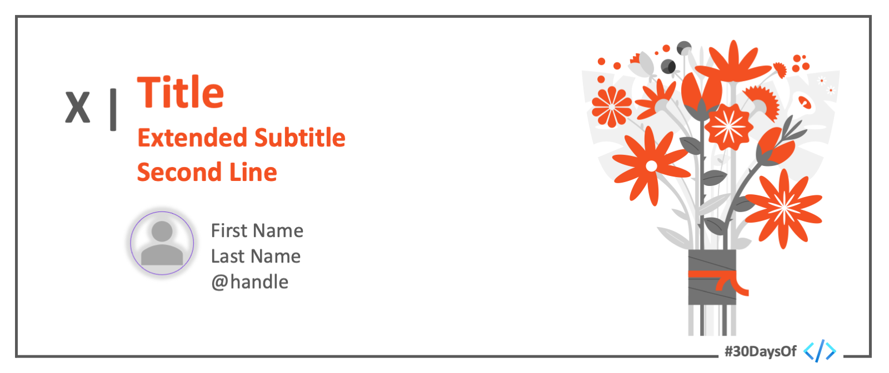

# Roadmap

 

:::success #30DaysOf Data Analytics

This 30Days Skilling content will help you build a strong confidence in Data Analysis using Microsoft Power BI. You will not only learn from technical experts and business leaders, you will also build project portfolio for yourself to showcase your growth. 

 * Read the ['Kickoff'](#kickoff) section for more details.
 * Meet The ['Team'](#meet-the-team) behind this project.
 * Explore the linked resources each week to skill up!
:::

---

## Kickoff 
Millions of tons of data are being generated everyday. Businesses want to make meaning from these data and among several others, they want to:
* Increase revenue
* Reduce Cost
* Optimize processes
* Improve Customer Experience and Satisfaction

 

With a good knowledge of Microsoft Power BI, you will be ablet to help organizations chieve their goals. 

## A Doze of Motivation
_Data is the new oil and I live in an oil country where nobody is drilling --- Olanrewaju Oyinbooke (2019)_. I am so happy right now that I can share a quote that inspires me so much at the early stage of my career. Interestingly, this quote is also by myself. 

You will agree with me that in Nigeria and Africa, we haven’t gotten the best value from the data around us yet and that is exactly what this track is trying to solve. By equipping you to be able to fill this gap. Did I just say Gap? Yes, there is a Data Gap.

## What is a Data Gap?
Data Gap is a way to represent the rate of data generation versus analysis. Daily, Data are being generated at an exponential rate but only few are being analyzed. What could cause this gap? a very obvious reason is unavailability of technical-know-how. we have fewer skilled data analyst compare to the available data.

To better understand the volume of data generated daily, let us check this  data never sleeps chart by domo.

 

This huge data gap means opportunity. as predicted by Microsoft, between 2020-2025, there will be 43million job roles in the data analysis and related role space. This will however favour only the skillful and not beginners.

To kick-off your learning journey, start by taking the onboarding guide here  

| Resource  | Details  | Link  |
|---|---|---|
| Create Microsoft 365 Developer Account   | To use Power BI Service (Online version), you will need to have a work or school account. Microsoft 365 Developer plan will give you access to Office 365 (E5) License with Power BI Pro included   | [Click Here](https://techcommunity.microsoft.com/t5/educator-developer-blog/recap-of-day-2-onboarding-session-30days-of-learning-nigeria/ba-p/3490280)   |

## Week 1: Explore The World of Analytics

| Day 1  | Day 2  | Day 3  | Day 4 | Day 5 | Day 6 | Day 7 |
|---|---|---|---|---|---|---|
| Exploring the world of Analytics. Understanding Business Value. Intro to MS Excel and Excel Look Up  | 40 Free Dataset for your personal projects. COVID19 Dataset in Excel - Web scraping examples  | Build Microsoft Excel Dashboard for COVID19 Cases   | Build Stunning Dashboard with Power BI from the Click of a Button | A Day in the Life of a Data Analyst | Reflect | Catch up with Microsoft Learn Resource |
| [Click Here](https://techcommunity.microsoft.com/t5/educator-developer-blog/exploring-the-world-of-analytics/ba-p/3497932) | [Click Here](https://techcommunity.microsoft.com/t5/educator-developer-blog/get-40-datasets-for-your-data-analysis-projects/ba-p/3500592) | [Click Here](https://techcommunity.microsoft.com/t5/educator-developer-blog/build-covid-19-dashboard-with-microsoft-excel/ba-p/3509050) | [Click Here](https://techcommunity.microsoft.com/t5/educator-developer-blog/build-power-bi-dashboard-from-teams-sharepoint-list-and-embed-in/ba-p/3512814) | [Click Here](https://techcommunity.microsoft.com/t5/educator-developer-blog/a-day-in-the-life-of-a-data-analyst-interview-with-industry/ba-p/3518673) | [Click Here](https://techcommunity.microsoft.com/t5/educator-developer-blog/learning-data-analysis-using-microsoft-excel-and-power-bi/ba-p/3528991) | Link for Day 7 | 

## Week 2: Getting Started With Power BI
| Day 8  | Day 9  | Day 10  | Day 11 | Day 12 | Day 13 | Day 14 |
|---|---|---|---|---|---|---|
| Introduction to Power BI Desktop  | Getting Familiar and working with Power Query   | Data Modelling and Welcome to the World of Data Analysis Expression (DAX)   | DAX Application | Page Navigation, Bookmarking and Tooltips in Power BI Desktop | Reflect | Catch up with Microsoft Learn Resources |
| [Click Here](https://techcommunity.microsoft.com/t5/educator-developer-blog/beginner-introduction-to-microsoft-power-bi/ba-p/3529938) | [Click Here](https://techcommunity.microsoft.com/t5/educator-developer-blog/use-power-query-to-clean-transform-and-clean-data-in-power-bi/ba-p/3531125) | [Click Here](https://techcommunity.microsoft.com/t5/educator-developer-blog/introduction-to-data-modelling-in-power-bi/ba-p/3537583) | [Click Here](https://techcommunity.microsoft.com/t5/educator-developer-blog/introduction-to-data-analysis-expression-dax-for-beginners/ba-p/3542815) | Link for Day 12 | [Click Here](https://techcommunity.microsoft.com/t5/educator-developer-blog/introduction-to-power-bi-clean-transform-and-load-data-with/ba-p/3552210) | self-paced | 

## Week 3: Data Storytelling with Power BI
| Day 15  | Day 16  | Day 17  | Day 18 | Day 19 | Day 20 | Day 21 |
|---|---|---|---|---|---|---|
| Data Storytelling in Power BI Desktop  | Create A Data Driven Story with Power BI Report  | Introduction to Power BI Service and Creating Interactive Dashboard   | Data Refresh Schedule in Power BI Service | Row Level Access Security in Power BI | Reflect | Catch up with Microsoft Learn Resources |
| [Click Here](https://techcommunity.microsoft.com/t5/educator-developer-blog/build-a-stunning-storytelling-dashboard-with-power-bi/ba-p/3553438) | [Click Here](https://techcommunity.microsoft.com/t5/educator-developer-blog/create-a-data-driven-story-with-power-bi-report/ba-p/3557885) | [Click Here](https://techcommunity.microsoft.com/t5/educator-developer-blog/introduction-to-power-bi-service-and-building-interactive/ba-p/3560976) | [Click Here](https://techcommunity.microsoft.com/t5/educator-developer-blog/import-vs-direct-query-method-and-data-refresh-in-power-bi/ba-p/3563207) | [Click Here](https://techcommunity.microsoft.com/t5/educator-developer-blog/row-level-security-in-power-bi-desktop/ba-p/3563521) | self-paced | self-paced | 

## Week 4: Capstone Project
| Day 22  | Day 23  | Day 24  | Day 25 | Day 26 | Day 27 | Day 28 |
|---|---|---|---|---|---|---|
| Your Project. It's Your Time to Showcase Your Skill  | Keep working on your project   | Keep working on your project  | Keep working on your project | Keep working on your project | Keep working on your project | Keep working on your project |
| [Access Your Capstone Project details here](https://techcommunity.microsoft.com/t5/educator-developer-blog/data-storytelling-power-bi-project-airlines-analysis/ba-p/3564493) | [Access Your Capstone Project details here](https://techcommunity.microsoft.com/t5/educator-developer-blog/data-storytelling-power-bi-project-airlines-analysis/ba-p/3564493) | [Access Your Capstone Project details here](https://techcommunity.microsoft.com/t5/educator-developer-blog/data-storytelling-power-bi-project-airlines-analysis/ba-p/3564493) | [Access Your Capstone Project details here](https://techcommunity.microsoft.com/t5/educator-developer-blog/data-storytelling-power-bi-project-airlines-analysis/ba-p/3564493) | [Access Your Capstone Project details here](https://techcommunity.microsoft.com/t5/educator-developer-blog/data-storytelling-power-bi-project-airlines-analysis/ba-p/3564493) | [Access Your Capstone Project details here](https://techcommunity.microsoft.com/t5/educator-developer-blog/data-storytelling-power-bi-project-airlines-analysis/ba-p/3564493) | [Access Your Capstone Project details here](https://techcommunity.microsoft.com/t5/educator-developer-blog/data-storytelling-power-bi-project-airlines-analysis/ba-p/3564493) | 

| Day 29  | Day 30  |
|---|---|
| Tidy Up your LinkedIn Profile   | It is time to Shine   |
| Link to be updated | Share your project on popular social media platform and keep developing yourself |

## Meet The Team

Check back to learn more about the team behind this learning track!