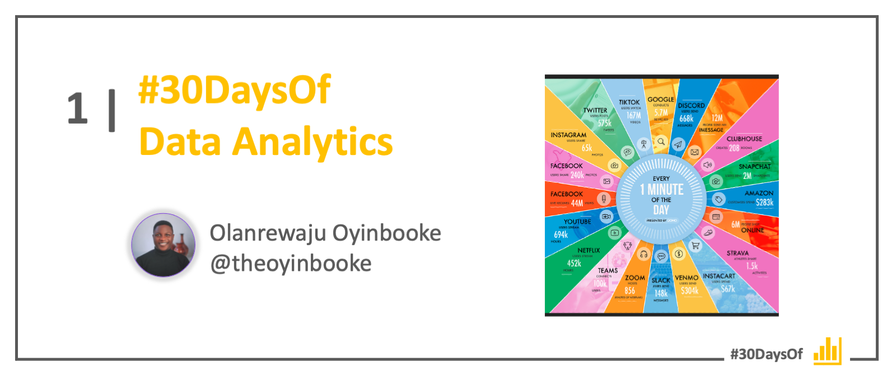

# Roadmap

 

:::success #30DaysOf Data Analytics

This 30Days Skilling content will help you build a strong confidence in Data Analysis using Microsoft Power BI. You will not only learn from technical experts and business leaders, you will also build project portfolio for yourself to showcase your growth. 

 * Read the ['Kickoff'](#kickoff) section for more details.
 * Meet The ['Team'](#meet-the-team) behind this project.
 * Explore the linked resources each week to skill up!
:::

---

## Kickoff 
Millions of tons of data are being generated everyday. Businesses want to extract meaning from this data so they can use it to:
* Increase revenue
* Reduce Cost
* Optimize processes
* Improve Customer Experience and Satisfaction

By skilling up on [Microsoft Power BI](https://powerbi.microsoft.com/), you will be able to help organizations like this achieve their goals.

### A Dose of Motivation
_Data is the new oil and I live in an oil country where nobody is drilling --- Olanrewaju Oyinbooke (2019)_. I am so happy right now that I can share a quote that inspires me so much at the early stage of my career. Interestingly, this quote is also by myself. 

You will agree with me that in Nigeria and Africa, we haven’t gotten the best value from the data around us yet and that is exactly what this track is trying to solve. By equipping you to be able to fill this gap. Did I just say Gap? Yes, there is a Data Gap.

### What is a Data Gap?
Data Gap is a way to represent the rate of data generation versus analysis. Daily, Data are being generated at an exponential rate but only few are being analyzed. What could cause this gap? a very obvious reason is unavailability of technical-know-how. we have fewer skilled data analyst compare to the available data.

To better understand the volume of data generated daily, let us check this  data never sleeps chart by domo.

 

This huge data gap means opportunity. as predicted by Microsoft, between 2020-2025, there will be 43million job roles in the data analysis and related role space. This will however favour only the skillful and not beginners.

### Onboarding Guide

To kick-off your learning journey, start with our [**onboarding guide**](https://techcommunity.microsoft.com/t5/educator-developer-blog/recap-of-day-2-onboarding-session-30days-of-learning-nigeria/ba-p/3490280) and setup your Microsoft 365 Developer Account. To use Power BI (online), **you will need to have a work or school account**. The Microsoft 365 Developer plan gives you an Office 365 (E5) License with Power BI Pro included. 

:::info How to signup for M365 Developer Account

 * You will need a Microsoft Account (e.g., an outlook.com email). 
 * To signup for a new account, visit https://signup.live.com .
 * Next, activate your M365 Account: https://aka.ms/ActivateM365DevAccount. 
 * Finally, sign up for the Power Apps Community Plan: https://aka.ms/PACommPlan 
:::

The video guide below can help with the setup process. As explained there, **the Power Apps Community plan is only needed for students on Power Platform Track**.

<iframe width="750" height="500" src="https://www.youtube.com/embed/9-EPFFmdJ-Y" title="30 Days of Learning - How to Setup Microsoft 365 and Power Apps Developer Account" frameborder="0" allow="accelerometer; autoplay; clipboard-write; encrypted-media; gyroscope; picture-in-picture" allowfullscreen></iframe>

---

## Week 1: Explore Analytics

:::info WEEK 1 SCHEDULE
 * **Day 01** - Exploring the world of Analytics. Intro to MS Excel | [**Resource**](https://techcommunity.microsoft.com/t5/educator-developer-blog/exploring-the-world-of-analytics/ba-p/3497932)
 * **Day 02** - 40 Free Datasets (incl. COVID19 Dataset). Web scraping examples  | [**Resource**](https://techcommunity.microsoft.com/t5/educator-developer-blog/get-40-datasets-for-your-data-analysis-projects/ba-p/3500592)
 * **Day 03** - Build Microsoft Excel Dashboard for COVID19 Cases | [**Resource**](https://techcommunity.microsoft.com/t5/educator-developer-blog/build-covid-19-dashboard-with-microsoft-excel/ba-p/3509050)
 * **Day 04** - Build Stunning Dashboard with Power BI from the Click of a Button | [**Resource**](https://techcommunity.microsoft.com/t5/educator-developer-blog/build-power-bi-dashboard-from-teams-sharepoint-list-and-embed-in/ba-p/3512814)
 * **Day 05** - A Day in the Life of a Data Analyst | [**Resource**](https://techcommunity.microsoft.com/t5/educator-developer-blog/a-day-in-the-life-of-a-data-analyst-interview-with-industry/ba-p/3518673)
 * **Day 06** - Reflect |  [**Resource**](https://techcommunity.microsoft.com/t5/educator-developer-blog/learning-data-analysis-using-microsoft-excel-and-power-bi/ba-p/3528991)
 * **Day 07** - Catch up with Microsoft Learn Resources | [_Self-Paced_]
:::

## Week 2: Power BI Quickstart

:::info WEEK 2 SCHEDULE
 * **Day 08** - Introduction to Power BI Desktop  | [**Resource**](https://techcommunity.microsoft.com/t5/educator-developer-blog/beginner-introduction-to-microsoft-power-bi/ba-p/3529938)
 * **Day 09** - Getting Familiar and working with Power Query | [**Resource**](https://techcommunity.microsoft.com/t5/educator-developer-blog/use-power-query-to-clean-transform-and-clean-data-in-power-bi/ba-p/3531125)
 * **Day 10** - Data Modelling and Data Analysis Expression (DAX)  | [**Resource**](https://techcommunity.microsoft.com/t5/educator-developer-blog/introduction-to-data-modelling-in-power-bi/ba-p/3537583)
 * **Day 11** - DAX Application  | [**Resource**](https://techcommunity.microsoft.com/t5/educator-developer-blog/introduction-to-data-analysis-expression-dax-for-beginners/ba-p/3542815)
 * **Day 12** - Page Navigation, Bookmarking  Tooltips in Power BI Desktop | [**Resource - TBA**] 
 * **Day 13** - Reflect | [**Resource**](https://techcommunity.microsoft.com/t5/educator-developer-blog/introduction-to-power-bi-clean-transform-and-load-data-with/ba-p/3552210)
 * **Day 14** - Catch up with Microsoft Learn Resources | [_Self-Paced_]
:::

## Week 3: Data Storytelling

:::info WEEK 3 SCHEDULE
 * **Day 15** - Data Storytelling in Power BI Desktop | [**Resource**](https://techcommunity.microsoft.com/t5/educator-developer-blog/build-a-stunning-storytelling-dashboard-with-power-bi/ba-p/3553438)
 * **Day 16** - Create A Data Driven Story with Power BI Report | [**Resource**](https://techcommunity.microsoft.com/t5/educator-developer-blog/create-a-data-driven-story-with-power-bi-report/ba-p/3557885)
 * **Day 17** - Introduction to Power BI. Create Interactive Dashboards.  | [**Resource**](https://techcommunity.microsoft.com/t5/educator-developer-blog/introduction-to-power-bi-service-and-building-interactive/ba-p/3560976)
 * **Day 18** - Data Refresh Schedule in Power BI Service | [**Resource**](https://techcommunity.microsoft.com/t5/educator-developer-blog/import-vs-direct-query-method-and-data-refresh-in-power-bi/ba-p/3563207)
 * **Day 19** - Row Level Access Security in Power BI | [**Resource**](https://techcommunity.microsoft.com/t5/educator-developer-blog/row-level-security-in-power-bi-desktop/ba-p/3563521)
 * **Day 20** - Reflect | [_Self-Paced_]
 * **Day 21** - Catch up with Microsoft Learn Resources | [_Self-Paced_]
:::

## Week 4: Capstone Project

:::info WEEK 4 SCHEDULE
 * **Day 22** - Showcase Your Skills & Learning | [**Capstone Project Details**](https://techcommunity.microsoft.com/t5/educator-developer-blog/data-storytelling-power-bi-project-airlines-analysis/ba-p/3564493) 
 * **Day 23** - Showcase Your Skills & Learning | [**Capstone Project Details**](https://techcommunity.microsoft.com/t5/educator-developer-blog/data-storytelling-power-bi-project-airlines-analysis/ba-p/3564493) 
 * **Day 24** - Showcase Your Skills & Learning | [**Capstone Project Details**](https://techcommunity.microsoft.com/t5/educator-developer-blog/data-storytelling-power-bi-project-airlines-analysis/ba-p/3564493) 
 * **Day 25** - Showcase Your Skills & Learning | [**Capstone Project Details**](https://techcommunity.microsoft.com/t5/educator-developer-blog/data-storytelling-power-bi-project-airlines-analysis/ba-p/3564493) 
 * **Day 26** - Showcase Your Skills & Learning | [**Capstone Project Details**](https://techcommunity.microsoft.com/t5/educator-developer-blog/data-storytelling-power-bi-project-airlines-analysis/ba-p/3564493) 
 * **Day 27** - Showcase Your Skills & Learning | [**Capstone Project Details**](https://techcommunity.microsoft.com/t5/educator-developer-blog/data-storytelling-power-bi-project-airlines-analysis/ba-p/3564493) 
 * **Day 28** - Showcase Your Skills & Learning | [**Capstone Project Details**](https://techcommunity.microsoft.com/t5/educator-developer-blog/data-storytelling-power-bi-project-airlines-analysis/ba-p/3564493) 
:::

## Wrap-Up

:::info IT'S TIME TO SHINE! 🌟
 * **Day 29** - Tidy up your LinkedIn Profile  | [**Resource - TBA**]
 * **Day 30** -  Share your project on Social Media! | [**Resource - TBA**]
:::

## Meet The Team

Check back to learn more about the team behind this learning track!