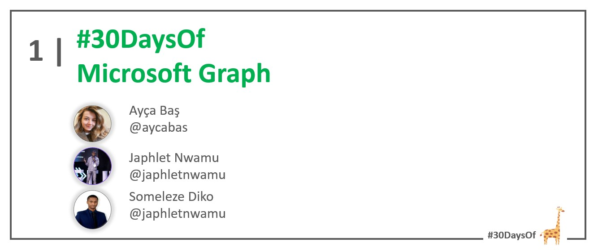
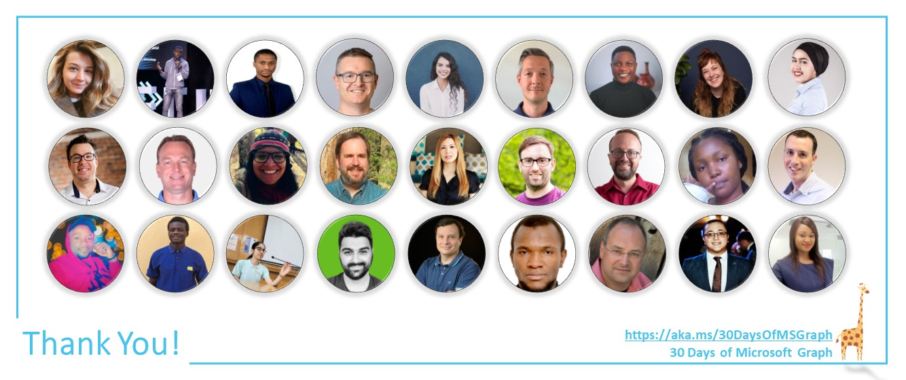

# Roadmap

:::success #30DaysOf - Microsoft Graph
30DaysOf Microsoft Graph is a gamified learning experience for JavaScript developers to compete in building apps with Microsoft Graph based on the [**Top Microsoft Graph Scenarios**](https://aka.ms/30DaysOfMSGraph/Scenarios), for a chance to win prizes. This curriculum is designed by Cloud Advocates at Microsoft.

* Read the ['Kickoff'](#kickoff) section for more details.
* Meet ['Team'](#meet-the-team) behind this project.
* Explore the linked resources each week to skill up!
:::

---

## Introduction 

Everyday millions of people spend their precious time on productivity tools. What if you use data and intelligence behind the Microsoft applications (Microsoft Teams, Outlook, and many other Office apps) to build automations and apps to boost productivity?   

The #30DaysOfMSGraph - Microsoft Graph Pilot Learning Program, welcomes you to contribute to building apps with Microsoft Graph to help developers understand Microsoft Graph with scenario-based applications.

---

## Kickoff

:::info ONBOARDING RESOURCES
Get started by familiarizing yourself with the [Onboarding Resources](https://aka.ms/30DaysOfMSGraph/Onboarding) for this #30DaysOfMSGraph challenge. Register to [the 30 Days of Microsoft Graph Challenge](https://aka.ms/30DaysOfMSGraph/Register) 🚀.
:::

---

## Week 1 - The Challenge begins!

:::info WEEK 1 SCHEDULE
* **Nov 01** - **Live Reactor Session**: [Kickoff Meeting! Join the 30 Days of Microsoft Graph Challenge!](https://aka.ms/30DaysOfMSGraph/Reactor/01) 
* **Nov 02** - Work on the Microsoft Graph Challenge: [Learn Path: Microsoft Graph Fundamentals | Module: What is Graph?](https://docs.microsoft.com/en-us/training/modules/msgraph-intro-overview/) | Video instructions of the Learn Path: [Microsoft Graph Fundamentals for Beginners](https://learn.microsoft.com/en-us/shows/beginners-series-to-microsoft-graph/)
* **Nov 03** - Work on the Microsoft Graph Challenge: [Learn Path: Microsoft Graph Fundamentals | Module: Configure a JavaScript application to retrieve Microsoft 365 data by using Microsoft Graph](https://docs.microsoft.com/en-us/training/modules/msgraph-javascript-app/) | Video instructions of the Learn Path: [Microsoft Graph Fundamentals for Beginners](https://learn.microsoft.com/en-us/shows/beginners-series-to-microsoft-graph/)
* **Nov 04** - Work on the Microsoft Graph Challenge: [Learn Path: Microsoft Graph Fundamentals | Module: Access user photo information by using Microsoft Graph](https://docs.microsoft.com/en-us/training/modules/msgraph-user-photo-information/) | Video instructions of the Learn Path: [Microsoft Graph Fundamentals for Beginners](https://learn.microsoft.com/en-us/shows/beginners-series-to-microsoft-graph/)
:::

---

## Week 2 - Call the Microsoft Graph!

:::info WEEK 2 SCHEDULE
* **Nov 07** - **Live Reactor Session**: [Build exciting apps with Microsoft Graph live!](https://aka.ms/30DaysOfMSGraph/Reactor/02)
* **Nov 08** - [Start calling the Microsoft Graph API in under 5 minutes! | Tips & Tricks](https://www.youtube.com/watch?v=f_3wc4UgqTI)
* **Nov 09** - Work on the Microsoft Graph Challenge: [Learn Path: Explore Microsoft Graph scenarios for JavaScript development | Module: Show a user's emails in a JavaScript app with Microsoft Graph](https://learn.microsoft.com/en-us/training/modules/msgraph-show-user-emails/)
* **Nov 10** - Work on the Microsoft Graph Challenge: [Learn Path: Explore Microsoft Graph scenarios for JavaScript development | Module: Access a user's calendar events in a JavaScript app with Microsoft Graph](https://learn.microsoft.com/en-us/training/modules/msgraph-access-user-events/)
* **Nov 11** - Work on the Microsoft Graph Challenge: [Learn Path: Explore Microsoft Graph scenarios for JavaScript development | Module: Download and upload files in a JavaScript app with Microsoft Graph](https://learn.microsoft.com/en-us/training/modules/msgraph-manage-files/)
:::

---

## Week 3 - Connect the Dots

:::info WEEK 3 SCHEDULE
* **Nov 14** - **Live Reactor Session**: [Build the "Take a break reminder" app with Microsoft Graph and Azure Functions](https://aka.ms/30DaysOfMSGraph/Reactor/03)
* **Nov 15** - Practice: [Take a break reminder app tutorial](https://aka.ms/TakeABreakReminder) 
* **Nov 16** - Practice: [Build seamless automations to boost productivity with Microsoft Graph, Event Hubs and Functions](https://dev.to/azure/build-seamless-automations-to-boost-productivity-with-microsoft-graph-azure-event-hubs-and-functions-1ho8)
* **Nov 17** - Submit your project proposal with Microsoft Graph: [Project Proposal Submission](https://aka.ms/30DaysOfMSGraph/Scenarios).
* **Nov 18** - **Live Reactor Session**: [Ask the experts – Office hours to brainstorm capstone projects](https://aka.ms/30DaysOfMSGraph/Reactor/04)
:::

---

## Week 4 - Time to build your own project with Microsoft Graph

:::info WEEK 4 SCHEDULE
* **Nov 21** - **Live Reactor Session**: [Can Microsoft Graph Do What?! Real-World Scenarios for Your Apps](https://aka.ms/30DaysOfMSGraph/Reactor/05)
* **Nov 22** - Get inspired! [All Things Microsoft Cloud: Microsoft 365 and Microsoft Graph](https://www.youtube.com/watch?v=MXq-M6qRffE)
* **Nov 23** - Capstone Project: Ask your questions to the experts on [GitHub discussions](https://aka.ms/30DaysOfMSGraph/GitHub/Discussions)
* **Nov 24** - Capstone Project: Ask your questions to the experts on [GitHub discussions](https://aka.ms/30DaysOfMSGraph/GitHub/Discussions)
* **Nov 25** - **Live Reactor Session**: [Ask the experts – Office hour](https://aka.ms/30DaysOfMSGraph/Reactor/06)
:::

---

## Week 5 - Submit your project

:::info WEEK 5 SCHEDULE 
* **Nov 28** - **Live Reactor Session**: [Meet the Microsoft Graph team!](https://aka.ms/30DaysOfMSGraph/Reactor/07)
* **Nov 29** - Submit your capstone project with Microsoft Graph: [Capstone Project Submission](https://aka.ms/30DaysOfMSGraph/GitHub/ProjectSubmission)
* **Nov 30** - **Live Reactor Session**: [Close out - 30 Days of Microsoft Graph Challenge](https://aka.ms/30DaysOfMSGraph/Reactor/08) 
:::

---

## Meet the team!

